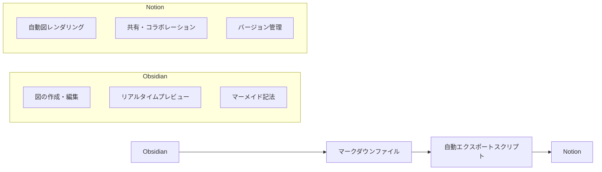
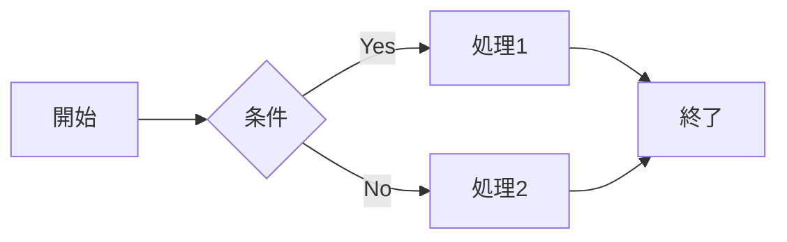
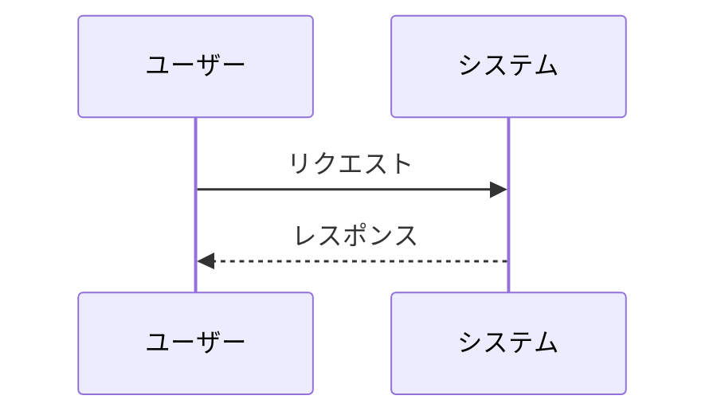
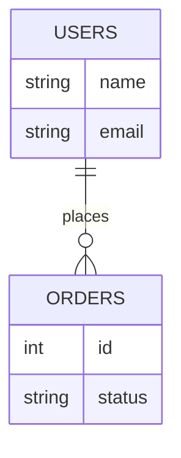
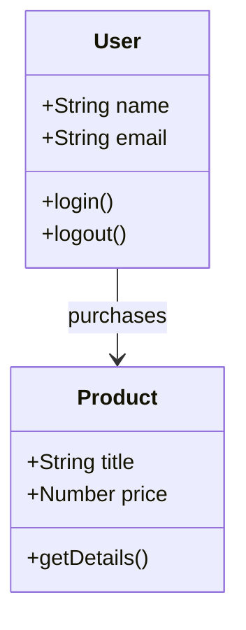
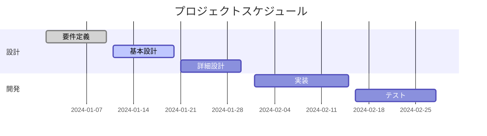

# Portfolio Showcase - 推奨ワークフローガイド

## 🎯 概要

このガイドでは、Obsidian での図作成から Notion への自動エクスポートまで、効率的なドキュメント管理ワークフローを説明します。

---

## 📋 ワークフロー概要



---

## 🚀 セットアップ手順

### 1. Obsidian のインストール・設定

1. **Obsidian をインストール**

   - [Obsidian 公式サイト](https://obsidian.md/)からダウンロード
   - 無料で利用可能

2. **ワークスペースの設定**

   - 新しい Vault を作成
   - `obsidian-workspace.md`ファイルを開く

3. **マーメイド記法の確認**
   - 設定 → コアプラグイン → マーメイド図を有効化
   - リアルタイムプレビューが表示されることを確認

### 2. 環境変数の設定

`.env`ファイルに以下を設定：

```env
VITE_NOTION_TOKEN=your_notion_integration_token
VITE_NOTION_PARENT_PAGE_ID=your_parent_page_id
```

### 3. スクリプトの確認

以下のコマンドが利用可能か確認：

```bash
npm run export:obsidian
```

---

## 🔄 日常的なワークフロー

### Step 1: Obsidian での図作成・編集

1. **`obsidian-workspace.md`を開く**

   ```bash
   # Obsidianで開く
   open obsidian-workspace.md
   ```

2. **マーメイド図を編集**

   ```mermaid
   graph TB
       A[開始] --> B{条件}
       B -->|Yes| C[処理1]
       B -->|No| D[処理2]
       C --> E[終了]
       D --> E
   ```

3. **リアルタイムプレビューで確認**
   - 図が正しく表示されることを確認
   - レイアウトや色を調整

### Step 2: 自動エクスポート

```bash
# ObsidianワークスペースからNotionにエクスポート
npm run export:obsidian
```

### Step 3: Notion での確認

1. **作成されたページを開く**

   - スクリプト実行後に表示される URL にアクセス

2. **図の表示確認**
   - マーメイド図が正しくレンダリングされているか確認
   - 必要に応じて調整

---

## 📊 利用可能な図の種類

### 1. フローチャート



### 2. シーケンス図



### 3. エンティティ関係図（ERD）



### 4. クラス図



### 5. ガントチャート



---

## 🛠️ トラブルシューティング

### よくある問題と解決策

#### 1. 図が表示されない

- **原因**: マーメイド記法の構文エラー
- **解決策**: Obsidian のプレビューで確認し、構文を修正

#### 2. Notion で図がテキストとして表示される

- **原因**: スクリプトの実行エラー
- **解決策**: ログを確認し、環境変数を再設定

#### 3. エクスポートが失敗する

- **原因**: Notion API の制限や権限問題
- **解決策**:
  - トークンの権限を確認
  - 親ページ ID の共有設定を確認

### デバッグコマンド

```bash
# 詳細なログで実行
DEBUG=* npm run export:obsidian

# 環境変数の確認
echo $VITE_NOTION_TOKEN
echo $VITE_NOTION_PARENT_PAGE_ID
```

---

## 📈 ワークフローの利点

### Obsidian の利点

- ✅ **リアルタイムプレビュー**: 編集中に図が即座に表示
- ✅ **豊富なプラグイン**: 図のカスタマイズが容易
- ✅ **ローカル管理**: オフラインでも作業可能
- ✅ **バージョン管理**: Git との連携が簡単

### Notion の利点

- ✅ **共有・コラボレーション**: チームでの編集が容易
- ✅ **自動図レンダリング**: マーメイド記法が自動で図に変換
- ✅ **モバイル対応**: スマートフォンでも確認可能
- ✅ **統合管理**: 他の Notion ページとの連携

### 自動化の利点

- ✅ **時間短縮**: 手動コピー&ペーストが不要
- ✅ **エラー削減**: 人間のミスを防止
- ✅ **一貫性**: 統一されたフォーマット
- ✅ **履歴管理**: 変更履歴の自動記録

---

## 🎯 ベストプラクティス

### 1. 図の命名規則

- ファイル名: `obsidian-workspace.md`
- 図のタイトル: 説明的で分かりやすい名前
- 変数名: 英語で統一

### 2. バージョン管理

```bash
# 変更をコミット
git add obsidian-workspace.md
git commit -m "Update system architecture diagram"

# エクスポート
npm run export:obsidian
```

### 3. 定期的な更新

- 週次で図の見直し
- 月次でワークフローの改善
- 四半期で全体の見直し

---

## 📞 サポート

### 問題が発生した場合

1. **ログの確認**: スクリプト実行時のエラーメッセージを確認
2. **環境変数の確認**: `.env`ファイルの設定を再確認
3. **Obsidian の確認**: マーメイド記法が正しく表示されるか確認
4. **Notion の確認**: ページの共有設定を確認

### 参考資料

- [Obsidian 公式ドキュメント](https://help.obsidian.md/)
- [Mermaid 記法リファレンス](https://mermaid.js.org/syntax/flowchart.html)
- [Notion API ドキュメント](https://developers.notion.com/)

---

## 🎉 完了チェックリスト

- [ ] Obsidian のインストール・設定完了
- [ ] 環境変数の設定完了
- [ ] 初回エクスポートの成功
- [ ] 図の表示確認完了
- [ ] ワークフローの理解完了
- [ ] チームメンバーへの共有完了

これで、効率的な図作成・管理ワークフローが完成です！
