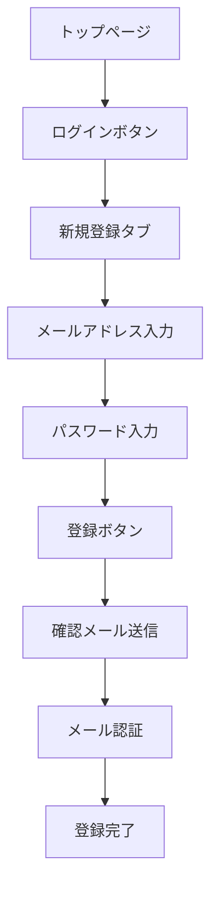
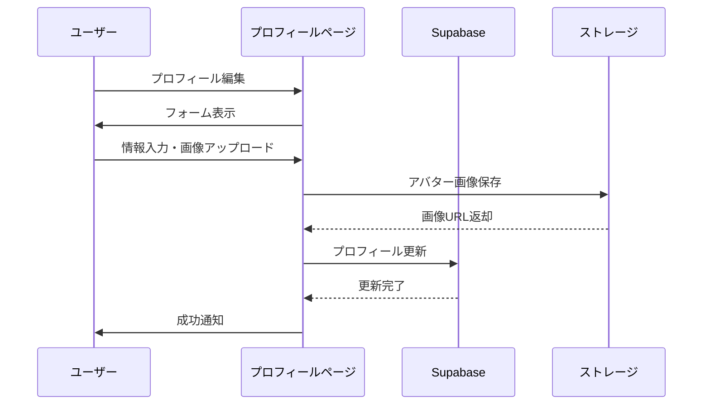
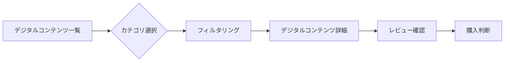
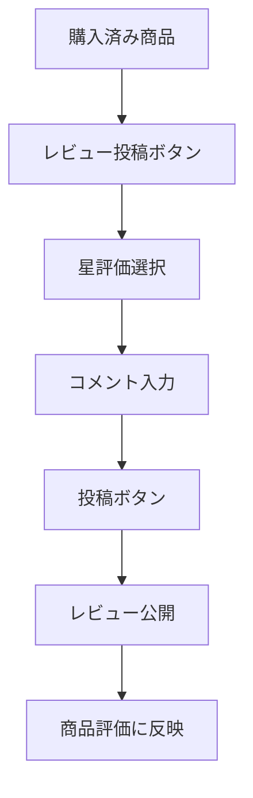
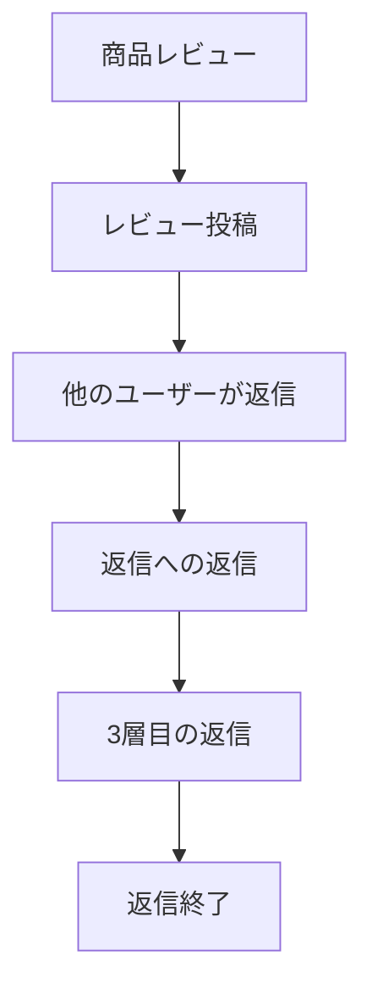
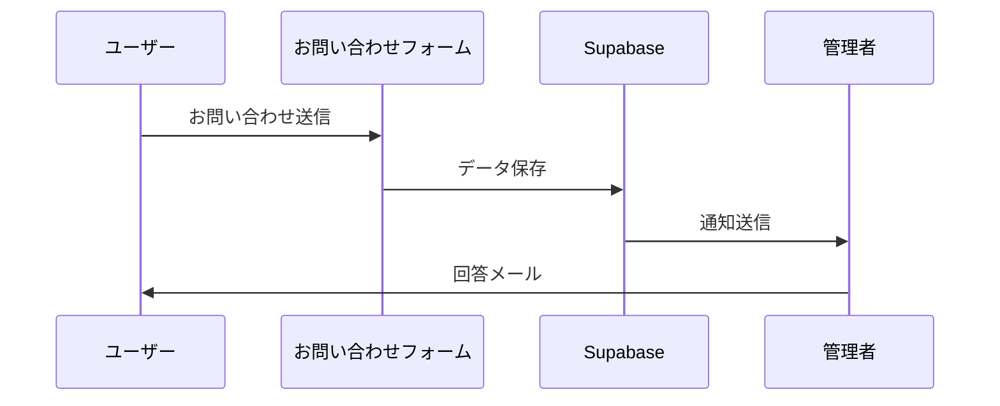

# Portfolio Showcase - ユーザーガイド

---

## 🆕 2025 年 7 月 27 日 主なアップデート

- **チャットボットの性能向上**: バックエンドシステムを刷新し、AI チャットボットの応答速度と安定性が向上しました。より快適に会話をお楽しみいただけます。

## 🆕 2025 年 7 月 25 日〜26 日 主なアップデート

- **高機能 FAQ チャットボット**: OpenAI API 統合による AI アシスタント機能
- **自動タイムアウト機能**: 5 分間の非活動でチャット自動クローズ、30 秒前警告表示
- **人気 FAQ タグ**: 15 個の FAQ 質問、ワンクリックで質問と回答を表示
- **チャット画面リセット**: チャット閉鎖時の完全な状態リセット
- **ユーザーアバター表示**: プロフィール画像の動的表示、アバター未設定時の人形アイコン
- **Information ページ改善**: UI 最適化、モバイルパフォーマンス向上、レスポンシブ対応
- **マーケティングダッシュボード**: Gorse API 連携、スクロール位置保持、集計ロジック修正

## 🆕 2025 年 7 月 21 日・22 日 主なアップデート

- お問い合わせフォームに「カテゴリ選択」「タイトル入力」「ピン留め」機能を追加
- お問い合わせ返信がスレッド形式に統合
- レビュー投稿・閲覧に「星数フィルタ」「日付・評価順ソート」「3 階層返信」機能を追加
- UI/UX・アクセシビリティの大幅改善（1 行表示、省略、aria-label 等）
- セキュリティ強化（メール認証必須、ログイン試行制限、Zod バリデーション）

---

## Version 2.0 - 基本ガイド

**ドキュメントバージョン:** 2.0
**最終更新:** 2025 年 7 月
**対象読者:** 一般ユーザー
**実装状況:** ✅ 実装済み

## 🚀 はじめに

Portfolio Showcase へようこそ！このガイドでは、サイトの基本的な使い方から、各機能の詳細な操作方法まで、わかりやすく説明します。

> **実装状況の表記**: 本ドキュメントでは ✅（実装済み）、⚠️（部分的実装）、📋（未実装）で機能の実装状況を示しています。詳細は [README.md](../README.md) をご覧ください

---

## 📋 目次

1. [アカウント管理](#アカウント管理) ✅
2. [プロフィール設定](#プロフィール設定) ✅
3. [デジタルコンテンツ購入](#デジタルコンテンツ購入) ✅
4. [レビュー投稿](#レビュー投稿) ⚠️
5. [お問い合わせ](#お問い合わせ) ✅
6. [FAQ チャットボット](#faq-チャットボット) ✅
7. [よくある質問](#よくある質問) ✅
8. [トラブルシューティング](#トラブルシューティング) ✅
9. [モバイルアプリ利用について](#モバイルアプリ利用について) 📋
10. [使い方のコツ](#使い方のコツ) ✅
11. [さらなるサポート](#さらなるサポート) ✅
12. [技術サポート](#技術サポート) ✅

---

## アカウント管理

### セキュリティ機能 ✅

#### メール認証の必須化

- 新規登録時は必ずメール認証が必要です
- 認証メールが届かない場合は、スパムフォルダをご確認ください
- メール認証が完了するまでログインできません

#### ログイン試行回数制限

- 10 回までログイン試行が可能です
- 制限に達した場合は、5 分後に再試行してください
- パスワードを忘れた場合は、パスワードリセット機能をご利用ください

#### パスワード要件

- 最低 8 文字以上
- 大文字・小文字・数字を含む
- セキュリティのため、強力なパスワードの使用を推奨

### アカウント登録

### ログイン手順

1. **トップページにアクセス**
2. **「ログイン」ボタンをクリック**
3. **登録済みのメールアドレスとパスワードを入力**
4. **「ログイン」ボタンをクリック**

### パスワードリセット

- ログイン画面で「パスワードを忘れた方」をクリック
- 登録メールアドレスを入力
- 送信されたリセットリンクから新しいパスワードを設定

---

## プロフィール設定

### 基本情報の編集

### アバター画像の設定

1. **マイページにアクセス**
2. **アバター画像をクリックして新しい画像を選択**
3. **画像をアップロード（自動保存）**

### バイオグラフィー（自己紹介文）の編集

- マイページのバイオグラフィーセクションで編集可能

---

## デジタルコンテンツ購入

### デジタルコンテンツ検索・閲覧 ✅

### 購入手順

1. **商品一覧から商品を選択**
2. **商品詳細ページで内容を確認**
3. **「購入する」ボタンをクリック**
4. **Stripe 決済画面で支払い情報を入力**
5. **決済完了後、購入済み商品にアクセス可能**

### 決済方法

- **クレジットカード**（Visa、MasterCard、American Express 対応）
- **デビットカード**
- **Apple Pay**（対応デバイスのみ）
- **Google Pay**（対応ブラウザのみ）

---

## レビュー投稿

### レビューシステムの拡張 ✅

- **星数フィルタ**: ★ 数でレビューを絞り込み可能
- **ソート機能**: 日付順・評価順で並び替え可能
- **3 階層返信**: レビュー → 返信 → 返信への返信まで可能
- **管理者レビュー**: 管理者のレビューは常に最後に表示されます（評価順の場合）

#### 3 層構造の返信機能

- **1 層目**: 商品へのレビュー投稿
- **2 層目**: レビューへの返信
- **3 層目**: 返信への返信（最大 3 層まで）

#### レビューの書き方

### レビュー返信機能

#### 返信のルール

- 建設的で有益な返信を心がけてください
- 誹謗中傷や個人攻撃は禁止です
- 返信は最大 3 層まで可能です
- 不適切な返信は管理者が削除する場合があります

### レビューガイドライン

- **星評価**: 1〜5 で評価
- **コメント**: 具体的で建設的な内容
- **禁止事項**:
  - 誹謗中傷
  - 個人情報の掲載
  - 商品と関係のない内容

### レビュー編集・削除

- 編集・削除は投稿者本人のみ可能
- 不適切なレビューは管理者が削除する場合があります

---

## お問い合わせ ⚠️

### お問い合わせフォーム

- **カテゴリ選択**: 「緊急」「退会申請」「機能提案」など 7 カテゴリから選択できます
- **タイトル入力**: お問い合わせの件名を入力できます
- **ピン留め**: 管理者が重要な問い合わせをピン留めできます
- **スレッド返信**: 管理者・ユーザー間でスレッド形式のやりとりが可能です

### 入力項目

- **お名前**（必須）
- **メールアドレス**（必須）
- **件名**（必須）
- **お問い合わせ内容**（必須）

### 回答時間

- **平日**: 24 時間以内に回答
- **土日祝**: 翌営業日に回答
- **緊急の場合**: 件名に「緊急」と記載

---

## FAQ チャットボット ✅

画面右下のチャットアイコンから、AI アシスタントに質問できます。

### 基本的な使い方

1. **起動**: 画面右下のチャットアイコンをクリック
2. **質問**: テキストボックスに質問を入力して送信
3. **回答**: AI（GPT-4o-mini）が即座に回答を生成

### 主な機能

- **人気 FAQ タグ**: よくある質問にワンクリックでアクセス（15 個の質問を人気度順に表示）
- **自動タイムアウト**: 5 分間非活動で自動クローズ（30 秒前に警告表示）
- **ユーザーアバター表示**: ログイン済みユーザーのプロフィール画像を表示
- **匿名利用可**: ログインなしでも利用可能

> 📘 **詳細情報**: より詳しい機能や技術仕様については、[ユーザーガイド詳細_JA.md](ユーザーガイド詳細_JA.md)をご覧ください

---

## よくある質問

### アカウント関連

**Q: パスワードを忘れました**
A: マイページから変更可能です

**Q: メールアドレスを変更したい**
A: マイページから変更可能です

**Q: アカウントを削除したい**
A: お問い合わせフォームからご連絡ください

### 購入・決済関連

**Q: 決済が失敗しました**
A: 以下をご確認ください：

- カード情報の正確性
- 有効期限
- 残高不足
- セキュリティコード

**Q: 領収書は発行されますか**
A: 決済完了後、登録メールアドレスに自動送信されます

**Q: 返金は可能ですか**
A: デジタル商品のため、原則として返金は行っておりません

### 技術的な問題

**Q: サイトが正常に表示されません**
A: 以下をお試しください：

- ブラウザの再読み込み
- キャッシュのクリア
- 別のブラウザでアクセス

**Q: アップロードできない画像があります**
A: 対応形式：JPEG、PNG、WebP（最大 5MB）

### FAQ チャットボット関連

**Q: チャットボットは 24 時間利用できますか？**
A: はい、チャットボットは 24 時間利用可能です。ただし、5 分間の非活動で自動的に閉じられます。

**Q: チャットボットの回答は正確ですか？**
A: GPT-4o-mini を使用しており、高精度な回答を提供しています。ただし、複雑な問題の場合はお問い合わせフォームをご利用ください。

**Q: チャットの履歴は保存されますか？**
A: セッション中のみ保存され、チャットが閉じられると履歴はクリアされます。プライバシー保護のためです。

**Q: 人気 FAQ タグは更新されますか？**
A: はい、利用頻度に応じて人気度が自動的に更新されます。

---

## トラブルシューティング

### よくあるエラーと解決方法

| エラー                     | 原因               | 解決方法                 |
| -------------------------- | ------------------ | ------------------------ |
| ログインできない           | パスワード間違い   | パスワードリセット       |
| 画像がアップロードできない | ファイルサイズ超過 | 5MB 以下に圧縮           |
| 決済が進まない             | ネットワークエラー | ページを再読み込み       |
| メールが届かない           | スパム判定         | 迷惑メールフォルダを確認 |
| チャットボットが起動しない | JavaScript 無効    | JavaScript を有効化      |

### サポート情報

- **推奨ブラウザ**: Chrome、Firefox、Safari、Edge（最新版）
- **推奨環境**: JavaScript 有効、Cookie 有効
- **モバイル対応**: iOS Safari、Android Chrome

---

## モバイルアプリ利用について

現在、専用のモバイルアプリは提供しておりませんが、モバイルブラウザからの利用に最適化されています。

### モバイル最適化機能

- レスポンシブデザイン
- タッチ操作対応
- 高速読み込み
- オフライン対応（一部機能）

---

## 使い方のコツ

### 効率的な商品探し

1. **カテゴリフィルタを活用**
2. **レビューの星評価で絞り込み**
3. **価格帯で検索**
4. **新着順・人気順で並び替え**

### プロフィールを充実させる

- アバター画像を設定
- 自己紹介文を記入
- 購入履歴を公開（任意）※次回バージョンアップの際追加予定の機能です。

### レビューを効果的に書く

- 具体的な使用感を記載
- 良い点と改善点をバランスよく
- 他の購入者の参考になる情報を提供

### FAQ チャットボットを活用する

- 人気 FAQ タグを先に確認
- 具体的な質問をする
- タイムアウト警告に注意
- 複雑な問題はお問い合わせフォームを利用

- 長いタイトルやメッセージは自動で省略表示されます
- すべてのボタン・タグは 1 行表示で見やすくなっています
- キーボード操作やスクリーンリーダーにも対応しています

---

## さらなるサポート

このガイドで解決しない問題がありましたら、お気軽にお問い合わせください。

- **お問い合わせフォーム**: サイト内の「お問い合わせ」から
- **FAQ チャットボット**: 画面右下のチャットアイコンから
- **回答時間**: 平日 24 時間以内
- **サポート言語**: 日本語、英語

---

## 技術サポート

- **開発者:** dev@your-domain.com
- **技術ドキュメント:** [技術文書\_JA.md](https://github.com/Yucco-K/showcase-docs/blob/main/%E6%8A%80%E8%A1%93%E6%96%87%E6%9B%B8_JA.md)
- **API 仕様書:** [API 仕様書\_JA.md](https://github.com/Yucco-K/showcase-docs/blob/main/API%E4%BB%95%E6%A7%98%E6%9B%B8_JA.md)
- **ユーザーガイド詳細:** [ユーザーガイド詳細\_JA.md](https://github.com/Yucco-K/showcase-docs/blob/main/%E3%83%A6%E3%83%BC%E3%82%B6%E3%83%BC%E3%82%AC%E3%82%A4%E3%83%89%E8%A9%B3%E7%B4%B0_JA.md)

---

_このガイドは定期的に更新されます。最新版は常にサイト上でご確認いただけます。_
