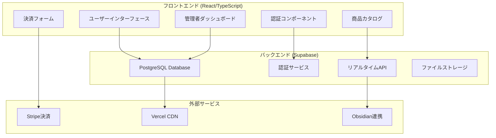
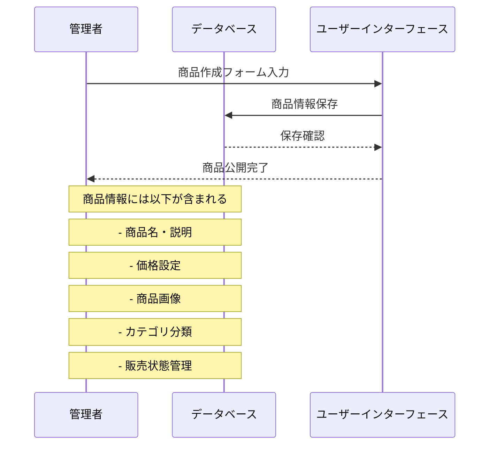
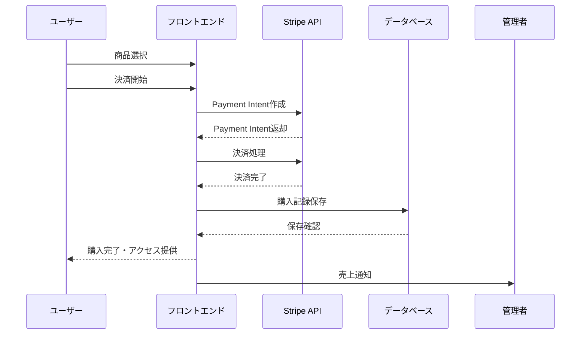
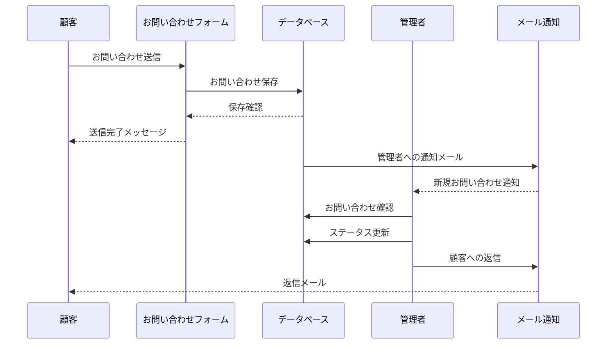
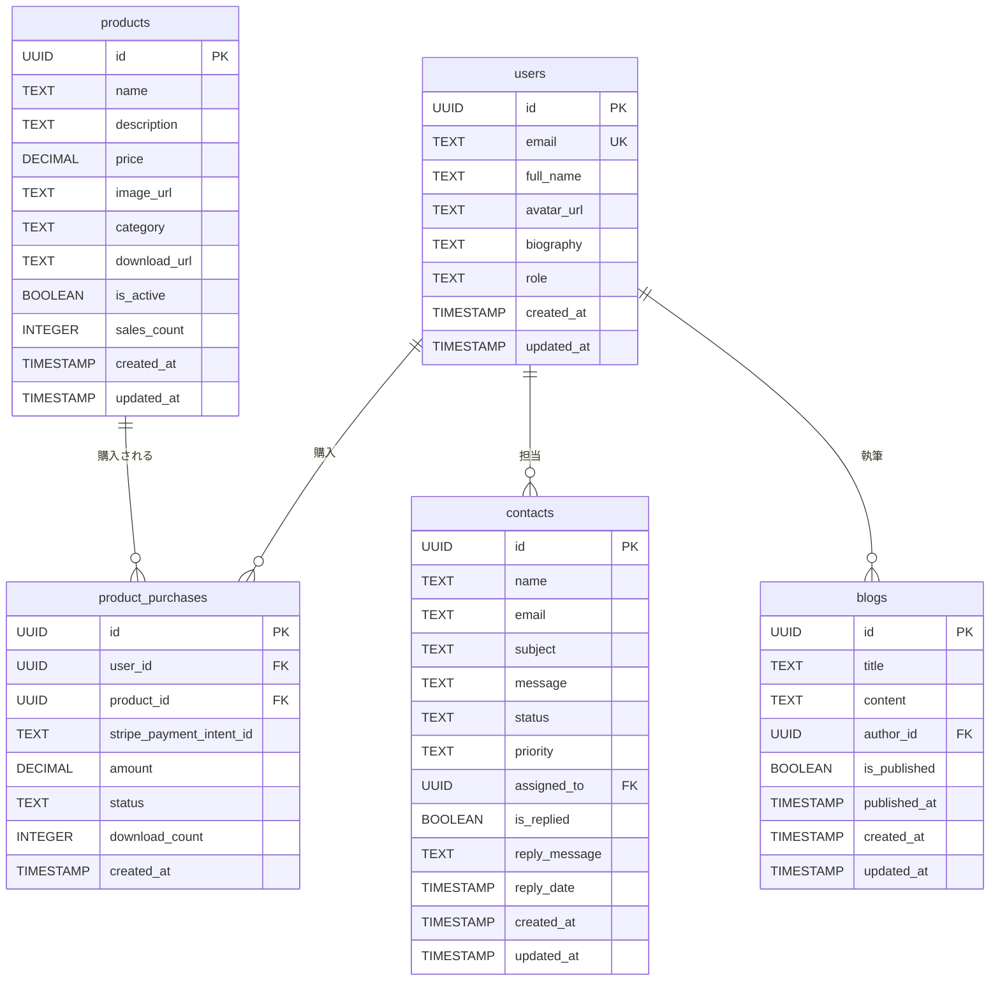
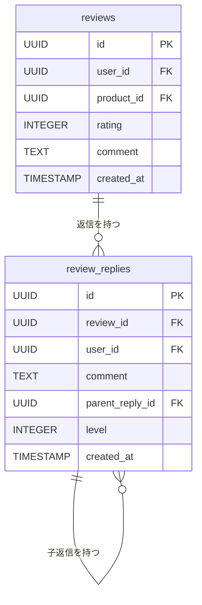

# セキュリティと機能強化アップデート（2025 年 7 月 21 日〜27 日）

## 🆕 2025 年 7 月 27 日 チャットボット API のリアーキテクチャ (Python + LangChain)

- **概要**: 従来の Deno ベースの Supabase Edge Function を、メンテナンス性と拡張性を目的として Python + FastAPI + LangChain ベースの Vercel Serverless Function に刷新しました。
- **技術スタック**:
  - **言語・フレームワーク**: `Deno` + `TypeScript` から `Python` + `FastAPI` へ全面移行。
  - **AI/LLM ライブラリ**: `LangChain`を導入し、プロンプト管理、RAG パイプライン、外部ツール連携の基盤を構築。
  - **デプロイ環境**: `Vercel Serverless Functions` の Python ランタイムを利用。
- **RAG (Retrieval-Augmented Generation) の実装**:
  - `Supabase` (`pgvector`) のベクトル検索を利用し、ドキュメントの埋め込み情報を基に関連情報を高速検索。
  - 複数の Markdown ドキュメントを知識源として一括で取り込めるように拡張。
- **API と開発環境の安定化**:
  - `FastAPI`のルーターを導入し、Vercel の`rewrites`設定と連携してフロントエンドとのルーティング競合を解消。
  - CORS 対応、非同期シングルトンパターンによる環境変数管理、構造化ロギングなどを実装。
- **API エンドポイント**: フロントエンドからは `/api/chat` を参照するように変更。

---

# セキュリティと機能強化アップデート（2025 年 7 月 21 日〜26 日）

---

## 🆕 2025 年 7 月 25 日〜26 日 主な機能追加・改善

### 高機能 FAQ チャットボットの実装

- **OpenAI API 統合**: GPT-4o-mini を使用した AI アシスタント機能
- **Supabase Edge Functions**: サーバーレス実装による安全な API 統合
- **自動タイムアウト機能**: 5 分間の非活動でチャット自動クローズ、30 秒前警告表示
- **人気 FAQ タグ**: 15 個の FAQ 質問データベース、人気度による自動ソート
- **チャット画面リセット**: 完全な状態リセット、メッセージ履歴クリア
- **ユーザーアバター表示**: プロフィール画像の動的表示、AuthProvider 連携
- **メッセージデータベース保存**: user_id、session_id 付きメッセージ保存、匿名ユーザー対応

### Information ページの大幅改善

- **UI/UX 最適化**: 背景シャボン玉削除、編集ボタン色変更、文字色改善
- **モバイルパフォーマンス**: モバイルでアニメーションシャボン玉を静止画版に置換
- **レスポンシブ対応**: 画面サイズ検出、モバイル Top ページ最適化
- **技術的改善**: スケルトン表示、スクロール位置保持、モーダルスクロール処理改善

### マーケティングダッシュボードの改善

- **Gorse API 連携**: 実データ連携による正確な集計
- **フィードバック統計**: 正確な集計ロジック修正
- **レコメンデーション指標**: 推薦精度の改善
- **UI 機能追加**: スクロール位置保持機能

### 依存関係管理

- **Zod 競合解決**: OpenAI SDK@5.10.2 との互換性確保
- **バージョンダウングレード**: Zod v4.0.5 から v3.25.76 への変更
- **エラー解決**: peer dependency conflict (ERESOLVE) エラー解消

### 本番デプロイ

- **Vercel 環境**: プレビュー環境での動作確認、本番環境への正常デプロイ
- **パフォーマンス最適化**: 依存関係エラー解決、最適化確認

## 🆕 2025 年 7 月 21 日・22 日 主な機能追加・改善

- コンタクト管理のスレッド返信機能追加（contact_reply_threads テーブル、RLS ポリシー）
- お問い合わせにカテゴリ（ENUM 型）、タイトル、ピン留め機能追加
- レビュー機能に星数フィルタ・日付/評価順ソート・3 階層ネスト返信機能追加
- UI/UX・アクセシビリティの大幅改善（1 行表示、省略、aria-label 等）
- 型定義・フック共通化、ESLint/型エラー解消
- セキュリティ強化（メール認証必須、ログイン試行制限、Zod バリデーション、XSS/SQLi 対策）

### 主要な DB スキーマ追加例

```sql
-- contacts テーブル拡張
ALTER TABLE contacts
  ADD COLUMN category contact_category DEFAULT 'other',
  ADD COLUMN title VARCHAR(200),
  ADD COLUMN is_pinned BOOLEAN DEFAULT false,
  ADD COLUMN pinned_at TIMESTAMP,
  ADD COLUMN pinned_by UUID;

-- contact_reply_threads テーブル
CREATE TABLE contact_reply_threads (
  id UUID PRIMARY KEY DEFAULT gen_random_uuid(),
  contact_id UUID REFERENCES contacts(id) ON DELETE CASCADE,
  sender_type TEXT NOT NULL, -- 'admin' or 'user'
  sender_id UUID REFERENCES profiles(id),
  message TEXT NOT NULL,
  created_at TIMESTAMPTZ NOT NULL DEFAULT now()
);

-- FAQ データテーブル
CREATE TABLE faqs (
  id UUID PRIMARY KEY DEFAULT gen_random_uuid(),
  question TEXT NOT NULL,
  answer TEXT NOT NULL,
  category TEXT NOT NULL,
  popularity INTEGER DEFAULT 0,
  created_at TIMESTAMPTZ DEFAULT now()
);

-- チャットメッセージテーブル
CREATE TABLE chat_messages (
  id UUID PRIMARY KEY DEFAULT gen_random_uuid(),
  user_id UUID REFERENCES profiles(id),
  session_id TEXT NOT NULL,
  role TEXT NOT NULL, -- 'user' or 'assistant'
  content TEXT NOT NULL,
  created_at TIMESTAMPTZ DEFAULT now()
);
```

### 型定義例

```typescript
export interface Contact {
	id: string;
	name: string;
	email: string;
	title?: string;
	message: string;
	category: ContactCategory;
	is_pinned: boolean;
	pinned_at?: string;
	pinned_by?: string;
	// ...
}

export interface FAQ {
	id: string;
	question: string;
	answer: string;
	category: "basic" | "payment" | "account" | "technical" | "policy";
	popularity: number;
}

export interface ChatMessage {
	id: string;
	user_id?: string;
	session_id: string;
	role: "user" | "assistant";
	content: string;
	created_at: string;
}
```

### UI/UX・アクセシビリティ改善

- すべてのボタン・バッジ・タグに 1 行表示/省略/aria-label を適用
- テーブル・カードの最小幅/列幅/文字サイズ統一
- レスポンシブ対応・キーボードナビゲーション

### フック・ユーティリティ最適化

- useSupabaseQuery 等の共通化、useFavorites/usePurchaseHistory 等の責務分離
- filterProducts, formatDate 等の共通関数化
- useMemo/useCallback によるパフォーマンス最適化

### セキュリティ強化

- メール認証必須化、カスタムリセットパスワード
- ログイン試行制限（5 回失敗で 30 分クールダウン等）
- Zod による入力バリデーション、XSS/SQLi 対策

### レビュー・コンタクト機能の拡張

- レビューの星数フィルタ・日付/評価順ソート・3 階層ネスト返信
- コンタクト管理のスレッド返信・カテゴリ・タイトル・ピン留め

### FAQ チャットボット機能

```typescript
// OpenAI API呼び出しの実装例
const completion = await openai.chat.completions.create({
	model: "gpt-4",
	messages: [
		{
			role: "system",
			content:
				"あなたは親切で知識豊富なアシスタントです。日本語で回答してください。",
		},
		{
			role: "user",
			content: userMessage,
		},
	],
	max_tokens: 500,
	temperature: 0.7,
});

// タイムアウト管理の実装
const resetTimeout = useCallback(() => {
	// 30秒前警告タイマー
	warningTimeoutRef.current = setTimeout(() => {
		setShowTimeoutWarning(true);
	}, 4.5 * 60 * 1000); // 4分30秒後

	// 5分後に自動クローズ
	timeoutRef.current = setTimeout(() => {
		setIsClosing(true);
		setTimeout(() => {
			setIsOpen(false);
		}, 2000);
	}, 5 * 60 * 1000);
}, []);

// 人気FAQの取得
export function getPopularFAQs(limit: number = 5): FAQ[] {
	return faqs.sort((a, b) => b.popularity - a.popularity).slice(0, limit);
}
```

---

# Portfolio Showcase - 技術文書

## Version 2.0 - 実用版

**ドキュメントバージョン:** 2.0
**最終更新:** 2025 年 7 月
**プロジェクト状況:** 本番稼働準備完了
**対象読者:** 実用的なクライアント、技術チーム
**実装状況:** ⚠️ 部分的実装（基本機能実装済み）

---

## アプリケーションの汎用性について

本アプリケーションには、私個人のポートフォリオやデジタルコンテンツをサンプルとして載せておりますが、この部分をあなたのポートフォリオやデジタルコンテンツに置き換えることによって、あなた自身やデジタルコンテンツをブランディングするためのツールとしてお役立ていただけます。

また、決済機能がついておりますので、実際に販売していただくことも可能です。アフターフォローや分析のための CRM ツールとしても利用できるものになっています。（今後のバージョンアップでは CRM の部分を強化していく予定です。）

### 主な活用シーン

- **個人ブランディング:** ポートフォリオサイトとしての活用 ✅
- **デジタルコンテンツ販売:** ソフトウェア、テンプレート、ドキュメント等の販売 ✅
- **サービス紹介:** 提供サービスの紹介とお問い合わせ受付 ✅
- **顧客管理:** 購入履歴やお問い合わせの一元管理 ⚠️
- **売上分析:** デジタルコンテンツ別売上や顧客行動の分析 📋

---

## サマリー

Portfolio Showcase Version 2.0 は、Version 1.0 からの大幅な進化を遂げた包括的な E コマース対応ポートフォリオプラットフォームです。このドキュメントでは、実用的なデプロイメントと統合のための詳細な技術仕様、アーキテクチャ決定、実装ガイドラインを提供します。

### プロジェクト進化の歴史

#### Version 1.0 (yucco-k.github.io)

**リポジトリ:** https://github.com/Yucco-K/yucco-k.github.io ※公開中
**技術スタック:** React + TypeScript + Vite + GitHub Pages
**特徴:**

- 静的ポートフォリオサイト
- GitHub Pages でのホスティング
- 基本的なプロジェクト紹介機能
- 3D グラフィックス（Three.js）による視覚的効果
- GitHub Actions による自動デプロイ

#### Version 2.0 (showcase) - 現在のバージョン

**リポジトリ:** https://github.com/Yucco-K/showcase ※非公開リポジトリ
**技術スタック:** React + TypeScript + Vite + Supabase + Stripe + Vercel
**特徴:**

- フルスタック E コマースプラットフォーム
- ユーザー認証・認可システム
- デジタル商品販売機能
- 決済処理システム
- お問い合わせ管理システム
- 管理者ダッシュボード
- リアルタイムデータ同期

### Version 1.0 からの主要な改善点

| 機能                   | Version 1.0  | Version 2.0                       |
| ---------------------- | ------------ | --------------------------------- |
| **認証**               | なし         | Supabase Auth with RLS            |
| **データベース**       | 静的データ   | PostgreSQL with Supabase          |
| **決済処理**           | なし         | Stripe 統合                       |
| **デプロイメント**     | GitHub Pages | Vercel with CI/CD                 |
| **コンテンツ管理**     | 静的ファイル | 動的 CMS                          |
| **カスタマーサポート** | なし         | お問い合わせ管理システム          |
| **管理者パネル**       | なし         | マルチレベル管理者ダッシュボード  |
| **セキュリティ**       | 基本         | エンタープライズグレード with RLS |
| **商品管理**           | なし         | デジタル商品販売プラットフォーム  |
| **ユーザー管理**       | なし         | プロフィール・購入履歴管理        |

---

## システムアーキテクチャ

### 高レベルアーキテクチャ



### 技術スタック詳細比較

#### Version 1.0 技術スタック

```json
{
	"frontend": {
		"framework": "React 19.1.0",
		"language": "TypeScript 5.8.3",
		"buildTool": "Vite 7.0.4",
		"styling": "Styled Components 6.1.19",
		"routing": "React Router DOM 7.6.3",
		"3dGraphics": "@react-three/fiber 9.2.0"
	},
	"deployment": {
		"hosting": "GitHub Pages",
		"ci/cd": "GitHub Actions",
		"domain": "yucco-k.github.io"
	},
	"features": {
		"authentication": false,
		"database": false,
		"payment": false,
		"adminPanel": false
	}
}
```

#### Version 2.0 技術スタック

```json
{
	"frontend": {
		"framework": "React 19.1.0",
		"language": "TypeScript 5.8.3",
		"buildTool": "Vite 7.0.4",
		"styling": "Styled Components 6.1.19",
		"routing": "React Router DOM 7.6.3",
		"stateManagement": "React Context + Custom Hooks"
	},
	"backend": {
		"database": "PostgreSQL 15+ (Supabase)",
		"authentication": "Supabase Auth",
		"api": "Supabase REST + Realtime",
		"storage": "Supabase Storage"
	},
	"payment": {
		"processor": "Stripe",
		"features": ["カード決済", "デジタルウォレット", "自動配信"]
	},
	"deployment": {
		"hosting": "Vercel",
		"ci/cd": "GitHub Actions + Vercel",
		"domain": "showcase.vercel.app"
	},
	"integrations": {
		"obsidian": "Obsidian API",
		"analytics": "Vercel Analytics"
	}
}
```

---

## デジタルコンテンツ販売フロー

### デジタルコンテンツ販売システム

**実装状況:** ✅ **Version 2.0 で実装済み**

Version 2.0 では、デジタルコンテンツ（ソフトウェア、テンプレート、ドキュメント等）の基本的な販売機能を実装しています。

#### 商品管理フロー

**実装状況:** ✅ **実装済み**



#### 購入フロー

**実装状況:** **一部実装済み**



#### 実装詳細

##### 商品データモデル

```sql
CREATE TABLE public.products (
    id UUID DEFAULT gen_random_uuid() PRIMARY KEY,
    name TEXT NOT NULL,
    description TEXT,
    price DECIMAL(10,2) NOT NULL,
    image_url TEXT,
    category TEXT,
    download_url TEXT,           -- デジタル商品のダウンロードURL
    is_active BOOLEAN DEFAULT true,
    sales_count INTEGER DEFAULT 0, -- 売上数
    created_at TIMESTAMP WITH TIME ZONE DEFAULT NOW(),
    updated_at TIMESTAMP WITH TIME ZONE DEFAULT NOW()
);
```

##### 購入記録データモデル

```sql
CREATE TABLE public.product_purchases (
    id UUID DEFAULT gen_random_uuid() PRIMARY KEY,
    user_id UUID REFERENCES public.users(id),
    product_id UUID REFERENCES public.products(id),
    stripe_payment_intent_id TEXT,
    amount DECIMAL(10,2) NOT NULL,
    status TEXT DEFAULT 'pending',
    download_count INTEGER DEFAULT 0, -- ダウンロード回数
    created_at TIMESTAMP WITH TIME ZONE DEFAULT NOW()
);
```

##### 決済処理実装

```typescript
// 決済処理フック
export const useProductPayment = () => {
	const processPayment = async (product: Product) => {
		try {
			// 1. Stripe Payment Intent作成
			const { data: paymentIntent } = await supabase.functions.invoke(
				"create-payment-intent",
				{
					body: { amount: product.price, currency: "jpy" },
				}
			);

			// 2. 決済処理
			const { error } = await stripe.confirmPayment({
				elements,
				confirmParams: {
					return_url: `${window.location.origin}/payment-success`,
				},
			});

			// 3. 購入記録保存
			if (!error) {
				await savePurchaseRecord(product.id, paymentIntent.id);
			}
		} catch (error) {
			console.error("決済エラー:", error);
		}
	};

	return { processPayment };
};
```

---

## お問い合わせ管理フロー

### カスタマーサポートシステム

**実装状況:** ✅ **Version 2.0 で実装済み**

Version 2.0 では、顧客からのお問い合わせを効率的に管理するシステムを実装しています。

#### お問い合わせ処理フロー

**実装状況:** ✅ **基本的な機能を実装済み**　（メールやプッシュ通知機能などについては、バージョンアップ時に実装予定）



#### お問い合わせ管理機能

##### データモデル

```sql
CREATE TABLE public.contacts (
    id UUID DEFAULT gen_random_uuid() PRIMARY KEY,
    name TEXT NOT NULL,
    email TEXT NOT NULL,
    subject TEXT,
    message TEXT NOT NULL,
    status TEXT DEFAULT 'new', -- new, in_progress, resolved, closed
    priority TEXT DEFAULT 'normal', -- low, normal, high, urgent
    assigned_to UUID REFERENCES public.users(id),
    is_replied BOOLEAN DEFAULT false,
    reply_message TEXT,
    reply_date TIMESTAMP WITH TIME ZONE,
    created_at TIMESTAMP WITH TIME ZONE DEFAULT NOW(),
    updated_at TIMESTAMP WITH TIME ZONE DEFAULT NOW()
);
```

##### 管理者ダッシュボード機能

```typescript
// お問い合わせ管理フック
export const useContactManagement = () => {
	const [contacts, setContacts] = useState<Contact[]>([]);
	const [filters, setFilters] = useState({
		status: "all",
		priority: "all",
		dateRange: "all",
	});

	// お問い合わせ一覧取得
	const fetchContacts = async () => {
		const { data, error } = await supabase
			.from("contacts")
			.select("*")
			.order("created_at", { ascending: false });

		if (data) setContacts(data);
	};

	// ステータス更新
	const updateContactStatus = async (id: string, status: string) => {
		const { error } = await supabase
			.from("contacts")
			.update({ status, updated_at: new Date() })
			.eq("id", id);

		if (!error) fetchContacts();
	};

	// 返信処理
	const replyToContact = async (id: string, replyMessage: string) => {
		const { error } = await supabase
			.from("contacts")
			.update({
				reply_message: replyMessage,
				is_replied: true,
				reply_date: new Date(),
				status: "resolved",
			})
			.eq("id", id);

		if (!error) {
			// メール送信処理
			await sendReplyEmail(id, replyMessage);
		}
	};

	return {
		contacts,
		filters,
		setFilters,
		fetchContacts,
		updateContactStatus,
		replyToContact,
	};
};
```

##### お問い合わせフォーム実装

```typescript
// お問い合わせフォームコンポーネント
export const ContactForm: React.FC = () => {
	const [formData, setFormData] = useState({
		name: "",
		email: "",
		subject: "",
		message: "",
	});

	const handleSubmit = async (e: React.FormEvent) => {
		e.preventDefault();

		try {
			const { error } = await supabase.from("contacts").insert([formData]);

			if (!error) {
				// 成功メッセージ表示
				showSuccessMessage("お問い合わせを送信しました");
				setFormData({ name: "", email: "", subject: "", message: "" });
			}
		} catch (error) {
			showErrorMessage("送信に失敗しました");
		}
	};

	return <form onSubmit={handleSubmit}>{/* フォームフィールド */}</form>;
};
```

---

## データベーススキーマ　※コア部分について

### ERD 図（Entity Relationship Diagram）



### コアテーブル

#### users (Supabase Auth から拡張)

```sql
CREATE TABLE public.users (
    id UUID REFERENCES auth.users(id) PRIMARY KEY,
    email TEXT UNIQUE NOT NULL,
    full_name TEXT,
    avatar_url TEXT,
    biography TEXT,
    role TEXT DEFAULT 'user', -- user, admin, moderator
    created_at TIMESTAMP WITH TIME ZONE DEFAULT NOW(),
    updated_at TIMESTAMP WITH TIME ZONE DEFAULT NOW()
);
```

#### products

```sql
CREATE TABLE public.products (
    id UUID DEFAULT gen_random_uuid() PRIMARY KEY,
    name TEXT NOT NULL,
    description TEXT,
    price DECIMAL(10,2) NOT NULL,
    image_url TEXT,
    category TEXT,
    download_url TEXT,
    is_active BOOLEAN DEFAULT true,
    sales_count INTEGER DEFAULT 0,
    created_at TIMESTAMP WITH TIME ZONE DEFAULT NOW(),
    updated_at TIMESTAMP WITH TIME ZONE DEFAULT NOW()
);
```

#### product_purchases

```sql
CREATE TABLE public.product_purchases (
    id UUID DEFAULT gen_random_uuid() PRIMARY KEY,
    user_id UUID REFERENCES public.users(id),
    product_id UUID REFERENCES public.products(id),
    stripe_payment_intent_id TEXT,
    amount DECIMAL(10,2) NOT NULL,
    status TEXT DEFAULT 'pending',
    download_count INTEGER DEFAULT 0,
    created_at TIMESTAMP WITH TIME ZONE DEFAULT NOW()
);
```

#### contacts

```sql
CREATE TABLE public.contacts (
    id UUID DEFAULT gen_random_uuid() PRIMARY KEY,
    name TEXT NOT NULL,
    email TEXT NOT NULL,
    subject TEXT,
    message TEXT NOT NULL,
    status TEXT DEFAULT 'new',
    priority TEXT DEFAULT 'normal',
    assigned_to UUID REFERENCES public.users(id),
    is_replied BOOLEAN DEFAULT false,
    reply_message TEXT,
    reply_date TIMESTAMP WITH TIME ZONE,
    created_at TIMESTAMP WITH TIME ZONE DEFAULT NOW(),
    updated_at TIMESTAMP WITH TIME ZONE DEFAULT NOW()
);
```

#### blogs

```sql
CREATE TABLE public.blogs (
    id UUID DEFAULT gen_random_uuid() PRIMARY KEY,
    title TEXT NOT NULL,
    content TEXT NOT NULL,
    author_id UUID REFERENCES public.users(id),
    is_published BOOLEAN DEFAULT false,
    published_at TIMESTAMP WITH TIME ZONE,
    created_at TIMESTAMP WITH TIME ZONE DEFAULT NOW(),
    updated_at TIMESTAMP WITH TIME ZONE DEFAULT NOW()
);
```

### セキュリティポリシー (RLS)

設定済み

---

## 認証・認可

### ユーザーロール

1. **匿名ユーザー:** 商品閲覧、ポートフォリオ表示
2. **認証済みユーザー:** 商品購入、プロフィール管理、購入履歴閲覧、お問い合わせ
3. **管理者ユーザー:** フルシステムアクセス、コンテンツ管理、お問い合わせ管理

### セキュリティ機能

- **JWT ベース認証** 自動リフレッシュ付き
- **Row Level Security (RLS)** データ分離
- **CORS ポリシー** API 保護
- **入力検証** とサニタイゼーション
- **レート制限** API エンドポイント
- **メール認証** 必須化 ✅
- **ログイン試行回数制限** 10 回/時間 ✅
- **Zod バリデーション** 全 API エンドポイントに適用 ✅

#### メール認証システム

```typescript
// メール認証設定
const emailAuthConfig = {
	// メール認証必須化
	signUpOptions: {
		emailConfirm: true,
		enforceEmailVerification: true,
		emailRedirectTo: `${window.location.origin}/auth/callback`,
	},
	// カスタムメールテンプレート
	emailTemplates: {
		confirmSignUp: {
			subject: "メールアドレスの確認",
			content: "以下のリンクをクリックしてメールアドレスを確認してください。",
		},
	},
};
```

#### ログイン試行回数制限

```typescript
// レート制限ミドルウェア
const loginRateLimit = rateLimit({
	windowMs: 60 * 60 * 1000, // 1時間
	max: 10, // 試行回数上限
	message: "ログイン試行回数が上限を超えました。1時間後に再試行してください。",
});

// ログイン試行回数のトラッキング
const trackLoginAttempt = async (email: string, success: boolean) => {
	const { data, error } = await supabase.from("login_attempts").insert({
		email,
		success,
		attempt_time: new Date(),
	});
};
```

#### Zod バリデーション

```typescript
// ユーザー入力スキーマ
const userSchema = z.object({
	email: z.string().email("有効なメールアドレスを入力してください"),
	password: z
		.string()
		.min(8, "パスワードは8文字以上である必要があります")
		.regex(/[A-Z]/, "大文字を含める必要があります")
		.regex(/[a-z]/, "小文字を含める必要があります")
		.regex(/[0-9]/, "数字を含める必要があります")
		.regex(/[^A-Za-z0-9]/, "特殊文字を含める必要があります"),
	name: z.string().min(1, "名前は必須です"),
});

// APIエンドポイントでのバリデーション
app.post("/api/users", async (req, res) => {
	try {
		const validatedData = userSchema.parse(req.body);
		// 検証済みデータで処理を続行
	} catch (error) {
		if (error instanceof z.ZodError) {
			return res.status(400).json({
				error: "入力データが無効です",
				details: error.errors,
			});
		}
	}
});
```

### レビュー管理システム

#### 3 層レビューコメント機能 ✅



#### レビューデータモデル

```sql
-- レビューテーブル
CREATE TABLE public.reviews (
    id UUID DEFAULT gen_random_uuid() PRIMARY KEY,
    user_id UUID REFERENCES public.users(id),
    product_id UUID REFERENCES public.products(id),
    rating INTEGER CHECK (rating >= 1 AND rating <= 5),
    comment TEXT NOT NULL,
    created_at TIMESTAMP WITH TIME ZONE DEFAULT NOW(),
    updated_at TIMESTAMP WITH TIME ZONE DEFAULT NOW()
);

-- レビュー返信テーブル
CREATE TABLE public.review_replies (
    id UUID DEFAULT gen_random_uuid() PRIMARY KEY,
    review_id UUID REFERENCES public.reviews(id),
    user_id UUID REFERENCES public.users(id),
    comment TEXT NOT NULL,
    parent_reply_id UUID REFERENCES public.review_replies(id),
    level INTEGER CHECK (level >= 1 AND level <= 3),
    created_at TIMESTAMP WITH TIME ZONE DEFAULT NOW(),
    updated_at TIMESTAMP WITH TIME ZONE DEFAULT NOW()
);
```

#### レビュー管理フック

```typescript
// レビュー管理フック
export const useReviewManagement = () => {
	// レビューと返信の取得
	const fetchReviewWithReplies = async (reviewId: string) => {
		const { data: review } = await supabase
			.from("reviews")
			.select(
				`
        *,
        user:users(full_name),
        replies:review_replies(
          *,
          user:users(full_name),
          child_replies:review_replies(
            *,
            user:users(full_name),
            grandchild_replies:review_replies(
              *,
              user:users(full_name)
            )
          )
        )
      `
			)
			.eq("id", reviewId)
			.single();

		return review;
	};

	// 返信の作成
	const createReply = async (
		reviewId: string,
		comment: string,
		parentReplyId?: string,
		level: number = 1
	) => {
		const { data, error } = await supabase.from("review_replies").insert({
			review_id: reviewId,
			comment,
			parent_reply_id: parentReplyId,
			level,
			user_id: auth.user()?.id,
		});

		return { data, error };
	};

	return {
		fetchReviewWithReplies,
		createReply,
	};
};
```

### セッション管理

```typescript
interface AuthContext {
	user: User | null;
	signIn: (email: string, password: string) => Promise<void>;
	signUp: (email: string, password: string) => Promise<void>;
	signOut: () => Promise<void>;
	isAdmin: (user: User) => boolean;
	isModerator: (user: User) => boolean;
}
```

---

## 決済統合

### Stripe 実装

```typescript
// Stripe決済処理
const processPayment = async (amount: number, currency: string) => {
	const paymentIntent = await stripe.paymentIntents.create({
		amount,
		currency,
		automatic_payment_methods: {
			enabled: true,
		},
	});

	return paymentIntent;
};
```

### 決済フロー

**実装状況:** ⚠️ **部分的実装（基本機能のみ）**

1. **商品選択** → ユーザーが商品を選択
2. **決済開始** → Stripe Payment Intent 作成
3. **決済処理** → クライアントサイドで決済完了
4. **注文記録** → データベースに購入記録保存
5. **デジタル配信** → 即座にデジタルコンテンツアクセス提供

### 売上管理

**実装状況:** ⚠️ **部分的実装（基本機能のみ）**

```typescript
// 売上分析フック
export const useSalesAnalytics = () => {
	const [salesData, setSalesData] = useState({
		totalRevenue: 0,
		totalSales: 0,
		monthlyData: [],
		topProducts: [],
	});

	const fetchSalesData = async () => {
		const { data } = await supabase
			.from("product_purchases")
			.select(
				`
        *,
        products(name, price)
      `
			)
			.eq("status", "succeeded");

		// 売上データの集計処理
		const analytics = calculateSalesAnalytics(data);
		setSalesData(analytics);
	};

	return { salesData, fetchSalesData };
};
```

**実装済み機能:**　※基本機能のみ

- 基本的な売上データ取得
- 商品別売上数カウント

**今後の拡張予定:**

- 詳細な売上分析ダッシュボード
- 顧客行動分析
- 売上予測機能
- レポート生成機能

---

## API 設計

### RESTful API

#### 商品管理

```http
GET /api/products          # 商品一覧取得
GET /api/products/:id       # 商品詳細取得
POST /api/products          # 商品作成（管理者）
PUT /api/products/:id       # 商品更新（管理者）
DELETE /api/products/:id    # 商品削除（管理者）
```

#### ユーザー管理

```http
GET /api/profile            # プロフィール取得
PUT /api/profile            # プロフィール更新
POST /api/avatar            # アバターアップロード
GET /api/purchases          # 購入履歴取得
```

#### 決済処理　※詳細については実際の運用時に実装予定

```http
POST /api/payments/create   # 決済Intent作成
POST /api/payments/confirm  # 決済確認
GET /api/purchases          # 購入履歴取得
```

#### お問い合わせ管理

```http
POST /api/contacts          # お問い合わせ送信
GET /api/contacts           # お問い合わせ一覧（管理者）
PUT /api/contacts/:id       # お問い合わせ更新（管理者）
POST /api/contacts/:id/reply # 返信送信（管理者）※未実装
```

#### ブログ管理

```http
GET /api/blogs              # ブログ一覧取得
GET /api/blogs/:id          # ブログ詳細取得
POST /api/blogs             # ブログ作成（管理者）
PUT /api/blogs/:id          # ブログ更新（管理者）
DELETE /api/blogs/:id       # ブログ削除（管理者）
```

### リアルタイム機能

**実装状況:** ✅ **基本機能実装済み**

```typescript
// Supabaseリアルタイムサブスクリプション
const subscription = supabase
	.channel("products")
	.on(
		"postgres_changes",
		{ event: "*", schema: "public", table: "products" },
		(payload) => {
			console.log("商品更新:", payload);
		}
	)
	.subscribe();
```

**実装済み機能:**

- 商品情報のリアルタイム更新
- データベース変更の即座反映

**今後の拡張予定:**

- 在庫数のリアルタイム表示
- 注文状況のリアルタイム更新
- チャット機能
- 通知システム

---

## デプロイメント

### Vercel 設定

```json
{
	"version": 2,
	"builds": [
		{
			"src": "package.json",
			"use": "@vercel/static-build",
			"config": {
				"distDir": "dist"
			}
		}
	],
	"routes": [
		{
			"src": "/(.*)",
			"dest": "/index.html"
		}
	]
}
```

### 環境変数（一部抜粋）

```bash
# Supabase設定
VITE_SUPABASE_URL=your_supabase_url
VITE_SUPABASE_ANON_KEY=your_supabase_anon_key

# Stripe設定
VITE_STRIPE_PUBLISHABLE_KEY=your_stripe_publishable_key
```

### CI/CD パイプライン

1. **コードプッシュ** → GitHub リポジトリ
2. **自動テスト** → Playwright テスト実行
3. **ビルド** → Vite ビルドプロセス
4. **デプロイ** → Vercel 自動デプロイ
5. **検証** → 本番環境テスト

---

## セキュリティ考慮事項

### データ保護

- **暗号化:** 転送時・保存時の暗号化
- **アクセス制御:** RLS による行レベルセキュリティ
- **入力検証:** クライアント・サーバーサイド両方での検証
- **セッション管理:** 安全な JWT トークン管理

### 監査とログ

```typescript
// セキュリティログ
const logSecurityEvent = (event: string, userId?: string) => {
	console.log(
		`[SECURITY] ${event} - User: ${userId} - Time: ${new Date().toISOString()}`
	);
};
```

---

## パフォーマンス最適化

### フロントエンド最適化

**実装状況:** ✅ **基本機能実装済み**

- **コード分割:** React.lazy()による遅延読み込み
- **画像最適化:** WebP 形式、遅延読み込み
- **キャッシュ戦略:** Service Worker、HTTP キャッシュ
- **バンドル最適化:** Tree shaking、minification

### バックエンド最適化

**実装状況:** ⚠️ **部分的実装**

- **データベース:** インデックス最適化、クエリ最適化 ✅ **実装済み**
- **CDN:** Vercel Edge Network 活用 ✅ **実装済み**
- **キャッシュ:** Redis、メモリキャッシュ **未実装**
- **非同期処理:** バックグラウンドジョブ **未実装**

**今後の拡張予定:**

- Redis キャッシュシステムの導入
- バックグラウンドジョブキュー（Bull/BullMQ）
- データベースクエリのさらなる最適化
- 画像圧縮・最適化の自動化

---

## 監視とメトリクス

### パフォーマンス監視

**実装状況:** ⚠️ **基本機能のみ実装**

```typescript
// パフォーマンスメトリクス
const trackPerformance = (metric: string, value: number) => {
	// Vercel Analytics送信
	analytics.track(metric, { value });
};
```

**実装済み機能:**

- Vercel Analytics による基本メトリクス
- エラーバウンダリー

### エラー監視

**実装状況:** ⚠️ **基本機能のみ実装**

- **フロントエンド:** エラーバウンダリー、コンソールログ ✅ **実装済み**
- **バックエンド:** Supabase ログ、カスタムエラーハンドリング ✅ **実装済み**
- **外部サービス:** Stripe Webhook **未実装**

### ビジネスメトリクス

**実装状況:** **未実装**

```typescript
// 売上・ユーザー行動分析
const trackBusinessMetrics = () => {
	// 売上追跡
	trackSales();

	// ユーザー行動追跡
	trackUserBehavior();

	// 商品パフォーマンス追跡
	trackProductPerformance();
};
```

**今後の拡張予定:**

- 詳細なビジネスメトリクスダッシュボード
- ユーザー行動分析（Heatmap、セッション記録）
- A/B テスト機能
- 自動レポート生成
- アラート・通知システム

---

## 今後の拡張計画

### 実装状況の凡例

- ✅ **実装済み:** Version 2.0 で完全に実装されている機能
- ⚠️ **部分的実装:** 基本機能のみ実装、拡張予定の機能
- **未実装:** 今後のバージョンアップで追加予定の機能

### 短期目標（3 ヶ月）

- [ ] 多言語対応の拡張 **未実装**
- [ ] 高度な分析機能 ⚠️ **基本機能のみ実装**
- [ ] 自動化されたマーケティング機能 **未実装**
- [ ] サブスクリプション機能 **未実装**

### 中期目標（6 ヶ月）

- [ ] AI 機能の統合 **未実装**
- [ ] 高度な CRM 機能 ⚠️ **基本機能のみ実装**
- [ ] マルチテナント対応 **未実装**
- [ ] 在庫管理システム **未実装**
- [ ] 配送管理システム **未実装**

### 長期目標（12 ヶ月）

- [ ] エンタープライズ機能 **未実装**
- [ ] 高度なセキュリティ機能 ⚠️ **基本機能のみ実装**
- [ ] グローバル展開 **未実装**
- [ ] パートナーエコシステム **未実装**
- [ ] マーケットプレイス機能 **未実装**

### Version 2.0 で実装済みの主要機能

✅ **実装済み:**

- ユーザー認証・認可システム（Supabase Auth）
- デジタル商品販売機能（Stripe 決済統合）
- お問い合わせ管理システム
- 管理者ダッシュボード
- ブログ管理システム
- 基本的なリアルタイム機能
- セキュリティ機能（RLS、JWT 認証）

⚠️ **部分的実装:**

- 売上管理（基本機能のみ）
- パフォーマンス監視（基本メトリクスのみ）
- エラー監視（フロントエンド・バックエンド基本機能のみ）
- バックエンド最適化（データベース・CDN のみ）

---

## 結論

Portfolio Showcase Version 2.0 は、Version 1.0 からの大幅な進化を遂げ、最新の技術スタックとベストプラクティスを採用した、スケーラブルで安全な E コマースプラットフォームです。

### 主要な成果

1. **静的サイトから動的プラットフォームへの進化**
2. **E コマース機能の実装**
3. **エンタープライズレベルのセキュリティ**
4. **スケーラブルなアーキテクチャ**
5. **包括的な管理者機能**

### 技術サポート

- **開発者:** dev@your-domain.com
- **API 仕様書:** [API 仕様書\_JA.md](https://github.com/Yucco-K/showcase-docs/blob/main/API%E4%BB%95%E6%A7%98%E6%9B%B8_JA.md)
- **ユーザーガイド:** [user-guide_JA.md](https://github.com/Yucco-K/showcase-docs/blob/main/user-guide_JA.md)
- **ユーザーガイド詳細:** [ユーザーガイド詳細\_JA.md](https://github.com/Yucco-K/showcase-docs/blob/main/%E3%83%A6%E3%83%BC%E3%82%B6%E3%83%BC%E3%82%AC%E3%82%A4%E3%83%89%E8%A9%B3%E7%B4%B0_JA.md)

---

## ライセンス情報

**Portfolio Showcase Version 2.0** は MIT ライセンスの下で提供されています。商用利用、修正・改変、配布が自由に可能です。著作権表示とライセンス表示の保持が必要です。

---

**ドキュメントバージョン:** 2.0
**最終更新:** 2025 年 7 月
**次回更新予定:** 機能追加時
