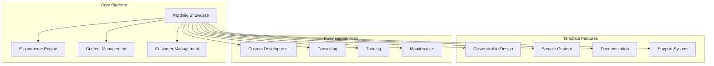
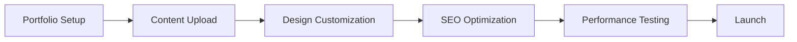
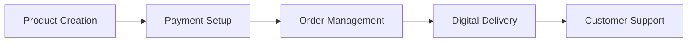
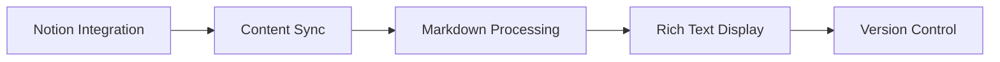
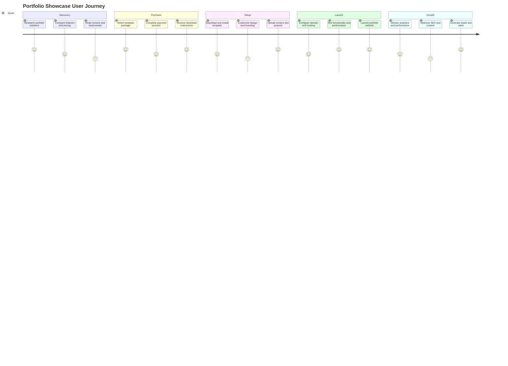
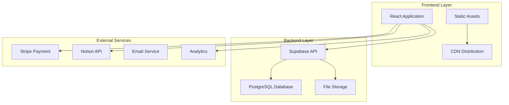
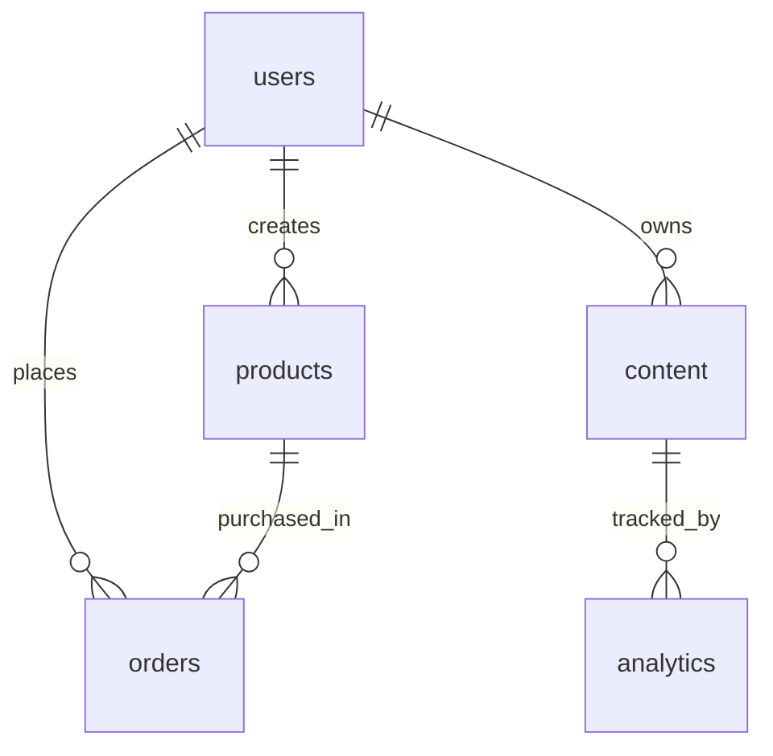

# Product Requirements Document (PRD) Template

## Portfolio Showcase Version 2.0

### Document Information

- **Document Type**: Product Requirements Document
- **Version**: 2.0.0
- **Last Updated**: January 18, 2025
- **Product**: Portfolio Showcase - Template Product
- **Target Audience**: Developers, Designers, Entrepreneurs
- **Business Model**: Template Product Sales + Customization Services

---

## 1. Executive Summary

### 1.1 Product Vision

Portfolio Showcase Version 2.0 is a **comprehensive portfolio platform designed as a template product** that enables professionals to showcase their expertise, sell digital products, and manage customer relationships effectively. The platform serves as a complete solution for digital content monetization and professional branding.

### 1.2 Business Objectives

#### Primary Goals

- **Template Product Sales**: Generate revenue through template licensing
- **Customization Services**: Provide additional development services
- **Market Expansion**: Reach global audience of professionals
- **Platform Growth**: Establish as leading portfolio template solution

#### Success Metrics

- **Revenue**: Monthly recurring revenue from template sales
- **Customer Satisfaction**: 4.5+ star rating on marketplace platforms
- **Market Share**: Top 10 portfolio template products
- **Customer Retention**: 80%+ renewal rate for customization services

### 1.3 Target Market

#### Primary Segments

- **Independent Developers**: Freelancers and consultants
- **Design Professionals**: UI/UX designers, graphic designers
- **Content Creators**: Bloggers, educators, course creators
- **Small Businesses**: Startups and growing companies

#### Market Size

- **Global Portfolio Market**: $2.5B (estimated)
- **Template Market**: $500M annually
- **Target Addressable Market**: $50M for our segment

---

## 2. Product Overview

### 2.1 Product Architecture



### 2.2 Key Features

#### Core Functionality

- **Portfolio Display**: Professional showcase of work and expertise
- **E-commerce Integration**: Digital product sales and licensing
- **Content Management**: Blog, project, and media management
- **Customer Relationship Management**: Contact and inquiry handling
- **User Authentication**: Secure user management system

#### Template Customization

- **Design Flexibility**: Customizable themes and layouts
- **Content Replacement**: Easy sample content substitution
- **Brand Integration**: Logo, colors, and branding customization
- **Domain Management**: Custom domain setup and configuration

#### Business Tools

- **Analytics Dashboard**: Performance and visitor analytics
- **SEO Optimization**: Built-in search engine optimization
- **Mobile Responsiveness**: Cross-device compatibility
- **Performance Optimization**: Fast loading and Core Web Vitals

### 2.3 Technology Stack

#### Frontend

- **React 19.1.0**: Modern UI framework
- **TypeScript 5.8.3**: Type-safe development
- **Vite 7.0.4**: Fast build tool
- **Styled Components**: CSS-in-JS styling

#### Backend

- **Supabase**: Backend-as-a-Service
- **PostgreSQL**: Relational database
- **Stripe**: Payment processing
- **Notion API**: Content management

#### Infrastructure

- **Vercel**: Hosting and deployment
- **GitHub Actions**: CI/CD pipeline
- **Playwright**: End-to-end testing

---

## 3. Market Analysis

### 3.1 Competitive Landscape

#### Direct Competitors

- **Webflow Templates**: High-end design templates
- **WordPress Themes**: Traditional CMS templates
- **Squarespace Templates**: All-in-one website builders
- **Custom Development**: Bespoke portfolio solutions

#### Competitive Advantages

- **Modern Technology Stack**: Latest web technologies
- **E-commerce Integration**: Built-in payment processing
- **Content Management**: Notion API integration
- **Performance**: Optimized for speed and SEO
- **Customization Services**: Professional development support

### 3.2 Market Trends

#### Industry Trends

- **Digital-First Business**: Increasing online presence needs
- **Content Monetization**: Growing demand for digital products
- **Personal Branding**: Professional online identity importance
- **Mobile Commerce**: Mobile-first shopping experiences

#### Technology Trends

- **JAMstack Architecture**: Modern web development approach
- **Headless CMS**: Flexible content management
- **Progressive Web Apps**: Enhanced mobile experiences
- **AI Integration**: Personalized user experiences

### 3.3 Customer Insights

#### Pain Points

- **Technical Complexity**: Difficulty in setting up professional portfolios
- **Design Limitations**: Lack of customization options
- **E-commerce Integration**: Complex payment setup
- **Content Management**: Difficult content updates
- **Performance Issues**: Slow loading websites

#### Customer Needs

- **Easy Setup**: Quick and simple portfolio creation
- **Professional Design**: High-quality, modern aesthetics
- **E-commerce Ready**: Built-in sales functionality
- **Mobile Optimized**: Responsive design across devices
- **SEO Friendly**: Search engine optimization
- **Customization**: Brand and content flexibility

---

## 4. Product Strategy

### 4.1 Product Positioning

#### Value Proposition

"Transform your professional presence with a modern, customizable portfolio platform that combines stunning design with powerful e-commerce capabilities."

#### Positioning Statement

For **professionals and small businesses** who need **a complete online presence solution**, Portfolio Showcase is a **template-based platform** that provides **professional design, e-commerce functionality, and content management** unlike traditional website builders that offer **limited customization and no built-in sales capabilities**.

### 4.2 Go-to-Market Strategy

#### Launch Phases

1. **Phase 1**: Template product launch on marketplace platforms
2. **Phase 2**: Direct sales through company website
3. **Phase 3**: Customization services expansion
4. **Phase 4**: Enterprise and agency partnerships

#### Marketing Channels

- **Marketplace Platforms**: ThemeForest, Creative Market
- **Content Marketing**: Blog, tutorials, case studies
- **Social Media**: LinkedIn, Twitter, Instagram
- **Email Marketing**: Newsletter and product updates
- **Partnerships**: Design agencies and freelancer communities

### 4.3 Pricing Strategy

#### Template Product Pricing

- **Basic Template**: $99 (single use)
- **Professional Template**: $199 (unlimited use)
- **Agency License**: $499 (client projects)

#### Customization Services

- **Basic Customization**: $500-1,000
- **Advanced Customization**: $1,000-3,000
- **Full Custom Development**: $3,000-10,000
- **Ongoing Maintenance**: $100-500/month

---

## 5. Feature Requirements

### 5.1 Core Features

#### Portfolio Management



**Requirements:**

- Drag-and-drop content management
- Multiple portfolio layouts and themes
- Image and video optimization
- SEO meta tag management
- Performance monitoring dashboard

#### E-commerce System



**Requirements:**

- Digital product upload and management
- Stripe payment integration
- Automated digital delivery
- Order history and tracking
- Refund and cancellation handling

#### Content Management



**Requirements:**

- Notion API integration for content
- Markdown to HTML conversion
- Rich text editor with formatting
- Content versioning and backup
- Multi-language support

### 5.2 Advanced Features

#### Analytics and Reporting

- **Visitor Analytics**: Page views, unique visitors, bounce rate
- **E-commerce Analytics**: Sales, conversion rates, revenue
- **Content Performance**: Popular posts, engagement metrics
- **SEO Performance**: Search rankings, organic traffic

#### Customer Management

- **Contact Forms**: Lead capture and management
- **Email Integration**: Automated email responses
- **Customer Database**: Contact information and history
- **Support System**: Ticket management and resolution

#### Customization Tools

- **Theme Builder**: Visual theme customization
- **Component Library**: Reusable UI components
- **Code Editor**: Advanced customization options
- **Preview System**: Real-time design preview

### 5.3 Technical Requirements

#### Performance Requirements

- **Page Load Time**: < 2 seconds
- **Core Web Vitals**: 90+ scores
- **Mobile Performance**: Optimized for mobile devices
- **SEO Score**: 95+ on Google PageSpeed Insights

#### Security Requirements

- **SSL Certificate**: HTTPS encryption
- **Data Protection**: GDPR compliance
- **Payment Security**: PCI DSS compliance
- **User Privacy**: Privacy policy and data handling

#### Scalability Requirements

- **Concurrent Users**: Support 1000+ simultaneous users
- **Content Storage**: Unlimited content uploads
- **Database Performance**: Fast query response times
- **CDN Integration**: Global content delivery

---

## 6. User Experience Design

### 6.1 User Personas

#### Primary Persona: Sarah - Independent Developer

- **Age**: 28
- **Occupation**: Freelance Full-Stack Developer
- **Goals**: Showcase projects, attract clients, sell digital products
- **Pain Points**: Time-consuming portfolio setup, limited customization
- **Tech Savvy**: High

#### Secondary Persona: Mike - Design Agency Owner

- **Age**: 35
- **Occupation**: Creative Director
- **Goals**: Present agency work, manage client projects
- **Pain Points**: Complex client management, limited e-commerce
- **Tech Savvy**: Medium

### 6.2 User Journey Mapping



### 6.3 Interface Design Principles

#### Design System

- **Typography**: Clean, readable fonts (Inter, Roboto)
- **Color Palette**: Professional, accessible colors
- **Spacing**: Consistent 8px grid system
- **Components**: Reusable, accessible UI components

#### Responsive Design

- **Mobile First**: Design for mobile devices first
- **Breakpoints**: 320px, 768px, 1024px, 1440px
- **Touch Targets**: Minimum 44px for mobile interaction
- **Performance**: Optimized images and assets

#### Accessibility

- **WCAG 2.1 AA**: Web accessibility compliance
- **Keyboard Navigation**: Full keyboard accessibility
- **Screen Reader Support**: ARIA labels and semantic HTML
- **Color Contrast**: 4.5:1 minimum contrast ratio

---

## 7. Technical Architecture

### 7.1 System Architecture



### 7.2 Database Design

#### Core Tables

- **users**: User authentication and profiles
- **products**: Digital products and pricing
- **orders**: Purchase transactions
- **content**: Portfolio content and media
- **analytics**: Performance and usage data

#### Data Relationships



### 7.3 API Design

#### RESTful Endpoints

```typescript
// User Management
GET    /api/users/:id
PUT    /api/users/:id
DELETE /api/users/:id

// Product Management
GET    /api/products
POST   /api/products
PUT    /api/products/:id
DELETE /api/products/:id

// Order Processing
POST   /api/orders
GET    /api/orders/:id
PUT    /api/orders/:id

// Content Management
GET    /api/content
POST   /api/content
PUT    /api/content/:id
DELETE /api/content/:id
```

#### Authentication & Authorization

- **JWT Tokens**: Secure session management
- **Role-based Access**: User, admin, super admin roles
- **API Rate Limiting**: Prevent abuse and ensure performance
- **CORS Configuration**: Secure cross-origin requests

---

## 8. Development Roadmap

### 8.1 Phase 1: Foundation (Months 1-3)

#### Core Development

- [x] **Basic Portfolio Template**: Responsive design and layout
- [x] **User Authentication**: Sign up, login, profile management
- [x] **Content Management**: Basic content upload and editing
- [x] **E-commerce Integration**: Stripe payment processing
- [x] **Database Setup**: PostgreSQL schema and relationships

#### Quality Assurance

- [x] **Unit Testing**: Component and utility testing
- [x] **Integration Testing**: API and database testing
- [x] **E2E Testing**: User workflow testing
- [x] **Performance Testing**: Load and stress testing

### 8.2 Phase 2: Enhancement (Months 4-6)

#### Feature Development

- [ ] **Advanced Customization**: Theme builder and component library
- [ ] **Analytics Dashboard**: Performance and visitor analytics
- [ ] **SEO Optimization**: Meta tags, sitemaps, structured data
- [ ] **Mobile App**: React Native mobile application

#### Platform Improvements

- [ ] **Performance Optimization**: Core Web Vitals improvement
- [ ] **Security Enhancement**: Multi-factor authentication
- [ ] **Scalability**: Load balancing and caching
- [ ] **Monitoring**: Error tracking and performance monitoring

### 8.3 Phase 3: Expansion (Months 7-12)

#### Business Features

- [ ] **Multi-language Support**: International market expansion
- [ ] **Agency Features**: Client management and white-labeling
- [ ] **Marketplace Integration**: Third-party app marketplace
- [ ] **AI Features**: Content recommendations and automation

#### Enterprise Features

- [ ] **Team Collaboration**: Multi-user workspace
- [ ] **Advanced Analytics**: Business intelligence dashboard
- [ ] **API Platform**: Public API for integrations
- [ ] **Enterprise Security**: SSO and advanced security features

---

## 9. Success Metrics

### 9.1 Key Performance Indicators (KPIs)

#### Business Metrics

- **Monthly Recurring Revenue (MRR)**: Target $50K by end of year
- **Customer Acquisition Cost (CAC)**: Target < $200 per customer
- **Customer Lifetime Value (CLV)**: Target > $1,000 per customer
- **Churn Rate**: Target < 5% monthly churn

#### Product Metrics

- **User Engagement**: Daily active users, session duration
- **Feature Adoption**: Usage of key features
- **Performance**: Page load times, Core Web Vitals scores
- **Quality**: Bug reports, support tickets

#### Market Metrics

- **Market Share**: Position in portfolio template market
- **Brand Awareness**: Search volume, social media mentions
- **Customer Satisfaction**: Net Promoter Score (NPS)
- **Competitive Position**: Feature comparison with competitors

### 9.2 Measurement Framework

#### Analytics Implementation

- **Google Analytics 4**: Website traffic and user behavior
- **Mixpanel**: Feature usage and user journey tracking
- **Hotjar**: User session recordings and heatmaps
- **Custom Dashboard**: Business metrics and KPIs

#### Reporting Schedule

- **Daily**: Key performance metrics
- **Weekly**: Feature usage and user feedback
- **Monthly**: Business performance and market analysis
- **Quarterly**: Strategic review and roadmap planning

---

## 10. Risk Assessment

### 10.1 Technical Risks

#### High Priority Risks

- **Performance Issues**: Slow loading times affecting user experience
- **Security Vulnerabilities**: Data breaches or payment fraud
- **Scalability Problems**: System unable to handle growth
- **Integration Failures**: Third-party service disruptions

#### Mitigation Strategies

- **Performance Monitoring**: Real-time performance tracking
- **Security Audits**: Regular security assessments
- **Load Testing**: Scalability testing and optimization
- **Backup Systems**: Redundant systems and disaster recovery

### 10.2 Business Risks

#### Market Risks

- **Competition**: New competitors entering the market
- **Market Changes**: Shifts in customer preferences
- **Economic Downturn**: Reduced spending on digital products
- **Regulatory Changes**: New privacy or security regulations

#### Mitigation Strategies

- **Competitive Analysis**: Regular market research
- **Customer Feedback**: Continuous user research
- **Diversification**: Multiple revenue streams
- **Compliance Monitoring**: Regulatory compliance tracking

### 10.3 Operational Risks

#### Resource Risks

- **Team Capacity**: Insufficient development resources
- **Technical Debt**: Accumulated technical issues
- **Knowledge Gaps**: Missing expertise in key areas
- **Timeline Delays**: Project schedule overruns

#### Mitigation Strategies

- **Resource Planning**: Adequate team sizing and hiring
- **Code Quality**: Regular refactoring and maintenance
- **Training Programs**: Skill development and knowledge sharing
- **Project Management**: Agile methodology and regular reviews

---

## 11. Launch Strategy

### 11.1 Pre-Launch Activities

#### Product Preparation

- **Beta Testing**: Invite-only beta program
- **Documentation**: Complete user guides and tutorials
- **Support System**: Customer support infrastructure
- **Legal Compliance**: Terms of service and privacy policy

#### Marketing Preparation

- **Website Launch**: Product landing page
- **Content Creation**: Blog posts, tutorials, case studies
- **Social Media**: Platform setup and content calendar
- **Email Marketing**: Newsletter and announcement lists

### 11.2 Launch Plan

#### Soft Launch (Week 1-2)

- **Limited Release**: Invite-only access
- **Feedback Collection**: User feedback and bug reports
- **Performance Monitoring**: System performance tracking
- **Iteration**: Quick fixes and improvements

#### Public Launch (Week 3-4)

- **Full Release**: Public availability
- **Marketing Campaign**: Multi-channel marketing push
- **Support Ramp-up**: Customer support team preparation
- **Analytics Setup**: Full tracking and reporting

#### Post-Launch (Month 2+)

- **Feature Iteration**: Based on user feedback
- **Marketing Optimization**: Campaign performance analysis
- **Support Optimization**: Customer service improvements
- **Growth Planning**: Expansion and scaling strategies

### 11.3 Success Criteria

#### Launch Success Metrics

- **User Acquisition**: 1,000+ sign-ups in first month
- **Revenue Generation**: $10K+ in first month
- **User Engagement**: 70%+ active user rate
- **Customer Satisfaction**: 4.5+ star rating

#### Post-Launch Goals

- **Market Penetration**: 5% market share within 6 months
- **Revenue Growth**: 20% month-over-month growth
- **Customer Retention**: 80%+ customer retention rate
- **Brand Recognition**: Top 3 in portfolio template market

---

## 12. Support and Maintenance

### 12.1 Customer Support

#### Support Channels

- **Email Support**: Primary support channel
- **Live Chat**: Real-time customer assistance
- **Knowledge Base**: Self-service documentation
- **Video Tutorials**: Step-by-step guides
- **Community Forum**: User community support

#### Support Levels

- **Basic Support**: Email support for template users
- **Priority Support**: Phone and live chat for premium users
- **Dedicated Support**: Account manager for enterprise clients
- **Custom Development**: Technical support for customizations

### 12.2 Maintenance Schedule

#### Regular Maintenance

- **Weekly**: Security updates and bug fixes
- **Monthly**: Feature updates and improvements
- **Quarterly**: Major version releases
- **Annually**: Platform architecture review

#### Emergency Procedures

- **Critical Issues**: 24/7 emergency response
- **Security Incidents**: Immediate security patch deployment
- **Performance Issues**: Real-time monitoring and resolution
- **Data Recovery**: Backup restoration procedures

### 12.3 Quality Assurance

#### Testing Procedures

- **Automated Testing**: CI/CD pipeline testing
- **Manual Testing**: User acceptance testing
- **Performance Testing**: Load and stress testing
- **Security Testing**: Vulnerability assessments

#### Quality Metrics

- **Code Coverage**: 90%+ test coverage
- **Bug Density**: < 1 bug per 1000 lines of code
- **Performance**: < 2 second page load times
- **Availability**: 99.9% uptime

---

## 13. Conclusion

Portfolio Showcase Version 2.0 represents a significant evolution from a simple portfolio template to a comprehensive platform solution. The product addresses real market needs with modern technology and professional design, positioning it for success in the competitive portfolio template market.

### Key Success Factors

#### Product Excellence

- **Modern Technology**: Latest web development technologies
- **Professional Design**: High-quality, customizable templates
- **E-commerce Integration**: Built-in sales capabilities
- **Performance**: Fast, optimized user experience

#### Market Positioning

- **Clear Value Proposition**: Professional portfolio with e-commerce
- **Target Audience**: Well-defined customer segments
- **Competitive Advantage**: Unique feature combination
- **Pricing Strategy**: Competitive and profitable pricing

#### Execution Strategy

- **Phased Development**: Manageable development phases
- **Quality Focus**: Comprehensive testing and quality assurance
- **Customer Feedback**: Continuous improvement based on user input
- **Scalable Architecture**: Growth-ready technical foundation

### Future Vision

Portfolio Showcase is positioned to become the leading portfolio platform for professionals and small businesses. With continuous innovation, customer-focused development, and strategic market expansion, the product will deliver significant value to users while achieving strong business growth.

The combination of modern technology, professional design, and comprehensive functionality creates a compelling product that addresses real market needs and positions the company for long-term success in the digital portfolio and e-commerce space.

---

**Document Version**: 2.0.0  
**Last Updated**: January 18, 2025  
**Next Review**: March 2025  
**Document Owner**: Product Team  
**Approval**: Product Manager
