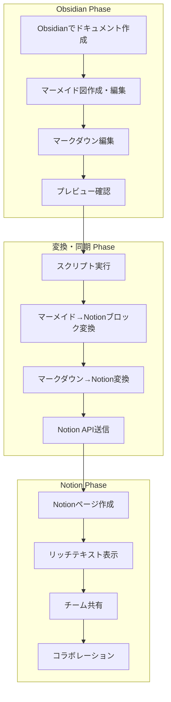
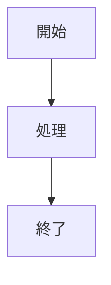
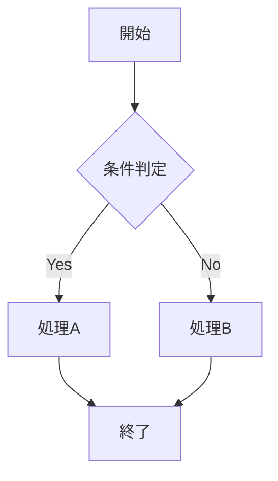
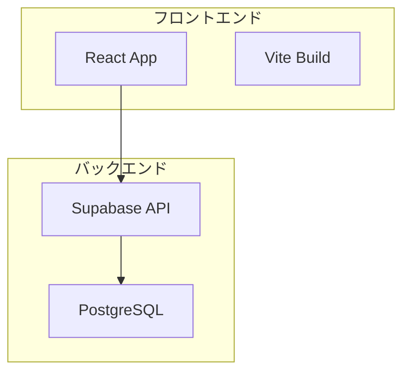
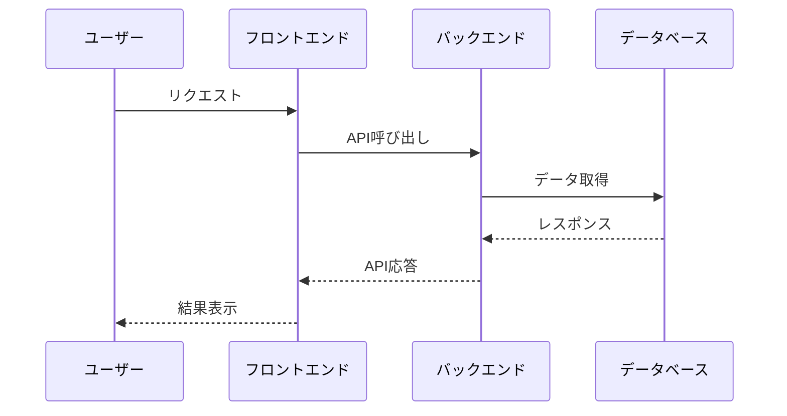

# Obsidian + Notion 連携ワークフローガイド

## Portfolio Showcase Version 2.0

### 概要

このガイドでは、**Obsidian**での効率的なドキュメント作成と**Notion**での共有・コラボレーションを組み合わせた推奨ワークフローについて説明します。このワークフローにより、Obsidian の豊富な機能を活用しつつ、Notion でのチーム共有も実現できます。

### ワークフローの利点

#### Obsidian の利点

- **リアルタイムプレビュー**: マークダウンの即座なプレビュー
- **豊富なプラグイン**: 図表作成、コードハイライト、タスク管理
- **ローカル管理**: オフライン作業とバージョン管理
- **高速動作**: 軽量でレスポンシブな編集環境

#### Notion の利点

- **チーム共有**: リアルタイムコラボレーション
- **リッチテキスト**: 美しい表示とインタラクティブ要素
- **データベース機能**: 構造化された情報管理
- **モバイル対応**: どこからでもアクセス可能

---

## 1. ワークフロー概要

### 1.1 全体フロー



### 1.2 推奨ツール構成

#### Obsidian 環境

- **Obsidian**: メインのマークダウンエディタ
- **Mermaid Plugin**: 図表作成
- **Advanced Tables**: テーブル編集
- **Code Block Enhancer**: コードハイライト
- **Git Plugin**: バージョン管理

#### 変換・同期ツール

- **Node.js**: スクリプト実行環境
- **@tryfabric/martian**: マークダウン →Notion 変換
- **Notion API**: Notion との連携
- **Custom Scripts**: 自動化スクリプト

#### Notion 環境

- **Notion Workspace**: チーム共有スペース
- **Database**: 構造化された情報管理
- **Templates**: 再利用可能なテンプレート
- **Integrations**: 外部サービス連携

---

## 2. セットアップ手順

### 2.1 Obsidian 環境の構築

#### 1. Obsidian のインストール

```bash
# macOS (Homebrew)
brew install --cask obsidian

# Windows
# https://obsidian.md/ からダウンロード

# Linux
# https://obsidian.md/ からダウンロード
```

#### 2. 推奨プラグインのインストール

**Mermaid Plugin**

- 設定 → コミュニティプラグイン → 検索: "Mermaid"
- インストールして有効化

**Advanced Tables**

- 設定 → コミュニティプラグイン → 検索: "Advanced Tables"
- インストールして有効化

**Code Block Enhancer**

- 設定 → コミュニティプラグイン → 検索: "Code Block Enhancer"
- インストールして有効化

#### 3. ワークスペース設定

```yaml
# .obsidian/workspace.json
{
  "main": { "active": "documentation.md", "leaf": true },
  "left": { "type": "file-explorer", "active": true },
  "right": { "type": "markdown-preview", "active": true },
}
```

### 2.2 変換スクリプトのセットアップ

#### 1. 依存関係のインストール

```bash
npm install @tryfabric/martian @notionhq/client dotenv
```

#### 2. 環境変数の設定

```bash
# .env
NOTION_TOKEN=your_notion_integration_token
NOTION_DATABASE_ID=your_database_id
```

#### 3. スクリプトの配置

```bash
# scripts/obsidian-to-notion.js を配置
# package.jsonにスクリプトを追加
```

### 2.3 Notion 環境の構築

#### 1. インテグレーションの作成

1. [Notion Developers](https://developers.notion.com/) にアクセス
2. "New integration" をクリック
3. インテグレーション名を入力
4. 必要な権限を設定
5. トークンを取得

#### 2. データベースの作成

1. Notion で新しいページを作成
2. "/database" でデータベースを追加
3. 以下のプロパティを設定：
   - **Title**: ページタイトル
   - **Status**: 公開状態
   - **Category**: ドキュメント分類
   - **Last Updated**: 最終更新日

#### 3. インテグレーションの接続

1. データベースページを開く
2. 右上の "Share" をクリック
3. 作成したインテグレーションを追加
4. "Full access" 権限を付与

---

## 3. ドキュメント作成ワークフロー

### 3.1 Obsidian での作成手順

#### 1. 新規ドキュメント作成

````markdown
# ドキュメントタイトル

## 概要

ドキュメントの概要を記述

## 詳細

詳細な内容を記述

## 図表


````

## コード例

```javascript
function example() {
	console.log("Hello World");
}
```

#### 2. マーメイド図の作成

**基本的なフローチャート**



**システムアーキテクチャ図**



**データフロー図**



#### 3. テーブルの作成

**Advanced Tables プラグインを使用**

```markdown
| 機能         | 説明                     | 優先度 |
| ------------ | ------------------------ | ------ |
| ユーザー認証 | ログイン・ログアウト機能 | 高     |
| 商品管理     | 商品の CRUD 操作         | 高     |
| 決済処理     | Stripe 連携              | 中     |
| レポート     | 売上レポート             | 低     |
```

#### 4. コードブロックの作成

**シンタックスハイライト付き**

```javascript
// JavaScript例
const apiCall = async (url) => {
	try {
		const response = await fetch(url);
		const data = await response.json();
		return data;
	} catch (error) {
		console.error("API call failed:", error);
		throw error;
	}
};
```

```typescript
// TypeScript例
interface User {
	id: string;
	name: string;
	email: string;
}

const getUser = async (id: string): Promise<User> => {
	const response = await fetch(`/api/users/${id}`);
	return response.json();
};
```

### 3.2 プレビューと確認

#### 1. リアルタイムプレビュー

- `Ctrl/Cmd + Shift + V` でプレビューモード切り替え
- 分割ビューで編集とプレビューを同時表示
- マーメイド図の即座なレンダリング確認

#### 2. 品質チェック

- マークダウンの文法チェック
- リンクの有効性確認
- 図表の表示確認
- コードのシンタックス確認

---

## 4. 変換・同期プロセス

### 4.1 自動変換スクリプト

#### スクリプト実行

```bash
# 単一ファイル変換
npm run convert:obsidian -- docs/technical-doc.md

# ディレクトリ一括変換
npm run convert:obsidian -- docs/

# 監視モード（ファイル変更を自動検知）
npm run convert:obsidian:watch -- docs/
```

#### 変換処理の詳細

**マーメイド図の処理**

````javascript
// マーメイドコードブロックを検出
const mermaidBlocks = content.match(/```mermaid\n([\s\S]*?)\n```/g);

// 各ブロックをNotionブロックに変換
mermaidBlocks.forEach((block) => {
	const mermaidCode = extractMermaidCode(block);
	const notionBlock = {
		type: "code",
		code: {
			rich_text: [{ type: "text", text: { content: mermaidCode } }],
			language: "mermaid",
		},
	};
	blocks.push(notionBlock);
});
````

**マークダウンの処理**

```javascript
// @tryfabric/martianを使用した変換
const { markdownToBlocks } = require("@tryfabric/martian");

const blocks = markdownToBlocks(markdownContent, {
	notionValidation: "loose",
	allowUnsupportedObjectType: true,
});
```

### 4.2 エラーハンドリング

#### 一般的なエラーと対処法

**マーメイド図のエラー**

```bash
# エラー: マーメイド図の構文エラー
Error: Mermaid syntax error in diagram

# 対処法: マーメイド記法の確認
# - 正しい構文を使用
# - 特殊文字のエスケープ
# - 図の複雑さの確認
```

**Notion API のエラー**

```bash
# エラー: API制限
Error: Rate limit exceeded

# 対処法: レート制限の回避
# - リクエスト間隔の調整
# - バッチ処理の実装
# - エラー時の再試行
```

**ファイルサイズのエラー**

```bash
# エラー: ファイルが大きすぎる
Error: File size exceeds limit

# 対処法: ファイルの分割
# - 大きなドキュメントを分割
# - チャンクサイズの調整
# - 圧縮処理の実装
```

### 4.3 変換結果の確認

#### 変換ログの確認

```bash
# 変換ログの表示
npm run convert:obsidian -- docs/technical-doc.md --verbose

# ログファイルの確認
tail -f logs/conversion.log
```

#### Notion での確認

1. Notion ワークスペースにアクセス
2. 対象データベースを開く
3. 新規作成されたページを確認
4. マーメイド図の表示確認
5. フォーマットの確認

---

## 5. Notion での共有・コラボレーション

### 5.1 ページ共有設定

#### 公開設定

1. Notion ページを開く
2. 右上の "Share" をクリック
3. "Share to web" を有効化
4. アクセス権限を設定：
   - **Can view**: 閲覧のみ
   - **Can comment**: コメント可能
   - **Can edit**: 編集可能

#### チーム共有

1. "Invite people" をクリック
2. メールアドレスを入力
3. 権限レベルを選択：
   - **Full access**: 完全アクセス
   - **Can edit**: 編集可能
   - **Can comment**: コメントのみ
   - **Can view**: 閲覧のみ

### 5.2 コラボレーション機能

#### リアルタイム編集

- 複数ユーザーが同時編集可能
- 変更の即座な同期
- 競合解決機能

#### コメント・フィードバック

```markdown
# コメントの追加方法

1. テキストを選択
2. 右クリック → "Comment"
3. コメントを入力
4. メンション機能で特定ユーザーに通知
```

#### バージョン管理

- 変更履歴の自動保存
- 以前のバージョンへの復元
- 変更の差分表示

### 5.3 データベース機能の活用

#### プロパティの活用

```yaml
# 推奨プロパティ設定
Title: ページタイトル
Status:
  - Draft (下書き)
  - Review (レビュー中)
  - Published (公開済み)
Category:
  - Technical (技術)
  - Business (ビジネス)
  - Design (デザイン)
Priority:
  - High (高)
  - Medium (中)
  - Low (低)
Last Updated: 最終更新日
Author: 作成者
```

#### ビュー機能

- **Table View**: 表形式での一覧表示
- **Board View**: カンバンボード形式
- **Calendar View**: カレンダー形式
- **Gallery View**: カード形式

#### フィルタ・ソート

```yaml
# フィルタ例
Status: Published
Category: Technical
Last Updated: Last 7 days

# ソート例
Last Updated: Descending
Priority: Ascending
Title: Alphabetical
```

---

## 6. 高度な機能

### 6.1 自動化とスケジューリング

#### 定期同期の設定

```bash
# cronジョブの設定 (Linux/macOS)
# 毎日午前9時に同期
0 9 * * * /usr/bin/node /path/to/scripts/obsidian-to-notion.js

# Windows Task Scheduler
# タスクスケジューラで定期実行を設定
```

#### GitHub Actions での自動化

```yaml
# .github/workflows/notion-sync.yml
name: Notion Sync
on:
  push:
    paths:
      - "docs/**/*.md"
  schedule:
    - cron: "0 9 * * *"

jobs:
  sync:
    runs-on: ubuntu-latest
    steps:
      - uses: actions/checkout@v3
      - uses: actions/setup-node@v3
        with:
          node-version: "18"
      - run: npm install
      - run: npm run convert:obsidian -- docs/
        env:
          NOTION_TOKEN: ${{ secrets.NOTION_TOKEN }}
          NOTION_DATABASE_ID: ${{ secrets.NOTION_DATABASE_ID }}
```

### 6.2 カスタマイズと拡張

#### カスタム変換ルール

```javascript
// カスタム変換ルールの例
const customRules = {
	// 特定のタグをNotionプロパティに変換
	tags: (content) => {
		const tagMatches = content.match(/#(\w+)/g);
		return tagMatches ? tagMatches.map((tag) => tag.slice(1)) : [];
	},

	// カスタムブロックタイプの処理
	customBlock: (content) => {
		// カスタム処理ロジック
		return processedContent;
	},
};
```

#### テンプレート機能

```markdown
# ドキュメントテンプレート

---

template: technical-doc
title: "{{title}}"
author: "{{author}}"
date: "{{date}}"
tags: ["{{tags}}"]

---

# {{title}}

## 概要

{{overview}}

## 詳細

{{details}}

## 図表

{{diagrams}}

## コード例

{{code_examples}}
```

### 6.3 パフォーマンス最適化

#### 変換速度の改善

```javascript
// 並列処理による高速化
const processFiles = async (files) => {
	const chunks = chunk(files, 5); // 5ファイルずつ処理
	const results = [];

	for (const chunk of chunks) {
		const promises = chunk.map((file) => processFile(file));
		const chunkResults = await Promise.all(promises);
		results.push(...chunkResults);
	}

	return results;
};
```

#### メモリ使用量の最適化

```javascript
// ストリーム処理によるメモリ効率化
const fs = require("fs");
const readline = require("readline");

const processLargeFile = (filePath) => {
	const fileStream = fs.createReadStream(filePath);
	const rl = readline.createInterface({
		input: fileStream,
		crlfDelay: Infinity,
	});

	rl.on("line", (line) => {
		// 行ごとの処理
		processLine(line);
	});
};
```

---

## 7. トラブルシューティング

### 7.1 よくある問題と解決法

#### Obsidian 関連

**マーメイド図が表示されない**

```bash
# 問題: マーメイドプラグインが無効
# 解決法:
1. 設定 → コミュニティプラグイン
2. Mermaidプラグインを有効化
3. Obsidianを再起動
```

**プレビューが更新されない**

```bash
# 問題: キャッシュの問題
# 解決法:
1. Ctrl/Cmd + R でプレビューをリロード
2. 設定 → ファイルとリンク → キャッシュをクリア
3. Obsidianを再起動
```

#### 変換スクリプト関連

**Node.js のバージョンエラー**

```bash
# 問題: Node.jsのバージョンが古い
# 解決法:
node --version  # バージョン確認
nvm install 18  # Node.js 18をインストール
nvm use 18      # バージョン切り替え
```

**依存関係のエラー**

```bash
# 問題: パッケージのインストールエラー
# 解決法:
rm -rf node_modules package-lock.json
npm install
```

#### Notion 関連

**API 認証エラー**

```bash
# 問題: トークンが無効または期限切れ
# 解決法:
1. Notion Developersでトークンを再生成
2. .envファイルを更新
3. スクリプトを再実行
```

**権限エラー**

```bash
# 問題: データベースへのアクセス権限がない
# 解決法:
1. Notionでデータベースを開く
2. Share → インテグレーションを追加
3. Full access権限を付与
```

### 7.2 デバッグ手法

#### ログレベルの調整

```javascript
// デバッグログの有効化
const debug = process.env.DEBUG === "true";

if (debug) {
	console.log("Processing file:", filePath);
	console.log("Content length:", content.length);
	console.log("Blocks generated:", blocks.length);
}
```

#### 段階的テスト

```bash
# 1. 単純なマークダウンファイルでテスト
echo "# Test" > test.md
npm run convert:obsidian -- test.md

# 2. マーメイド図を含むファイルでテスト
echo "# Test\n\`\`\`mermaid\ngraph TD\nA-->B\n\`\`\`" > test-mermaid.md
npm run convert:obsidian -- test-mermaid.md

# 3. 複雑なファイルでテスト
npm run convert:obsidian -- docs/complex-doc.md
```

### 7.3 パフォーマンス監視

#### 変換時間の測定

```javascript
const startTime = Date.now();

// 変換処理
await convertDocument(filePath);

const endTime = Date.now();
const duration = endTime - startTime;

console.log(`Conversion completed in ${duration}ms`);
```

#### メモリ使用量の監視

```javascript
const used = process.memoryUsage();

console.log("Memory usage:");
console.log(`  RSS: ${Math.round(used.rss / 1024 / 1024)} MB`);
console.log(`  Heap Total: ${Math.round(used.heapTotal / 1024 / 1024)} MB`);
console.log(`  Heap Used: ${Math.round(used.heapUsed / 1024 / 1024)} MB`);
```

---

## 8. ベストプラクティス

### 8.1 ドキュメント作成

#### マークダウンの書き方

```markdown
# 良い例

## セクションタイトル

明確で簡潔なセクションタイトル

### サブセクション

適切な階層構造

- リストアイテム 1
- リストアイテム 2
  - ネストしたアイテム

**重要なポイント**は太字で強調

> 引用文は適切にブロッククォートを使用
```

#### マーメイド図の作成

```mermaid
# 良い例: シンプルで理解しやすい図
graph TD
    A[開始] --> B[処理]
    B --> C[終了]

    style A fill:#e1f5fe
    style C fill:#c8e6c9
```

### 8.2 ファイル管理

#### ディレクトリ構造

```
docs/
├── technical/
│   ├── architecture/
│   ├── api/
│   └── deployment/
├── business/
│   ├── requirements/
│   ├── roadmap/
│   └── metrics/
└── templates/
    ├── technical-doc.md
    ├── prd-template.md
    └── meeting-notes.md
```

#### ファイル命名規則

```bash
# 良い例
technical-architecture-v2.0.md
api-documentation.md
deployment-guide.md

# 避けるべき例
doc1.md
temp.md
untitled.md
```

### 8.3 バージョン管理

#### Git での管理

```bash
# 定期的なコミット
git add docs/
git commit -m "Update technical documentation"

# ブランチ戦略
git checkout -b feature/new-doc
# 作業完了後
git checkout main
git merge feature/new-doc
```

#### バックアップ戦略

```bash
# 自動バックアップスクリプト
#!/bin/bash
DATE=$(date +%Y%m%d_%H%M%S)
tar -czf "docs_backup_$DATE.tar.gz" docs/
aws s3 cp "docs_backup_$DATE.tar.gz" s3://backup-bucket/
```

---

## 9. 今後の拡張予定

### 9.1 機能拡張

#### 予定されている機能

- **リアルタイム同期**: ファイル変更の自動検知
- **双方向同期**: Notion → Obsidian の同期
- **テンプレート管理**: 高度なテンプレート機能
- **バッチ処理**: 大量ファイルの一括処理

#### 技術的改善

- **WebSocket 連携**: リアルタイム通信
- **キャッシュ機能**: 変換結果のキャッシュ
- **並列処理**: マルチスレッド処理
- **エラー回復**: 自動エラー回復機能

### 9.2 統合拡張

#### 外部サービス連携

- **GitHub**: リポジトリとの直接連携
- **Slack**: 通知機能
- **Google Drive**: ファイル同期
- **Dropbox**: クラウドストレージ連携

#### 開発ツール連携

- **VS Code**: エディタ統合
- **JetBrains**: IDE 統合
- **Postman**: API テスト連携
- **Figma**: デザインファイル連携

---

## 10. まとめ

### 10.1 ワークフローの効果

#### 生産性の向上

- **効率的なドキュメント作成**: Obsidian の豊富な機能
- **自動化による時間短縮**: スクリプトによる自動変換
- **リアルタイムコラボレーション**: Notion でのチーム共有
- **品質の向上**: プレビュー機能による即座の確認

#### コスト削減

- **ツール費用**: 無料ツールの活用
- **学習コスト**: 標準的なマークダウン記法
- **メンテナンスコスト**: 自動化による運用効率化
- **エラーコスト**: 早期発見による修正コスト削減

### 10.2 成功のポイント

#### 技術的ポイント

- **適切なツール選択**: 用途に合ったツールの組み合わせ
- **自動化の実装**: 手作業の最小化
- **エラーハンドリング**: 堅牢なエラー処理
- **パフォーマンス最適化**: 効率的な処理

#### 運用ポイント

- **標準化**: 統一されたワークフロー
- **ドキュメント化**: 手順の明確化
- **トレーニング**: チームメンバーの教育
- **継続的改善**: フィードバックによる改善

### 10.3 今後の展望

このワークフローは、ドキュメント作成と共有の効率化を実現する強力なソリューションです。今後も技術の進歩に合わせて継続的に改善し、より多くのユーザーに価値を提供していきます。

#### 短期的目標

- ワークフローの安定化
- ユーザーフィードバックの収集
- 機能の最適化

#### 長期的目標

- エコシステムの構築
- コミュニティの形成
- 業界標準への貢献

---

**ドキュメント作成日**: 2025 年 1 月 18 日
**最終更新日**: 2025 年 1 月 18 日
**バージョン**: 2.0.0
**作成者**: 開発チーム
**承認者**: テクニカルリード
