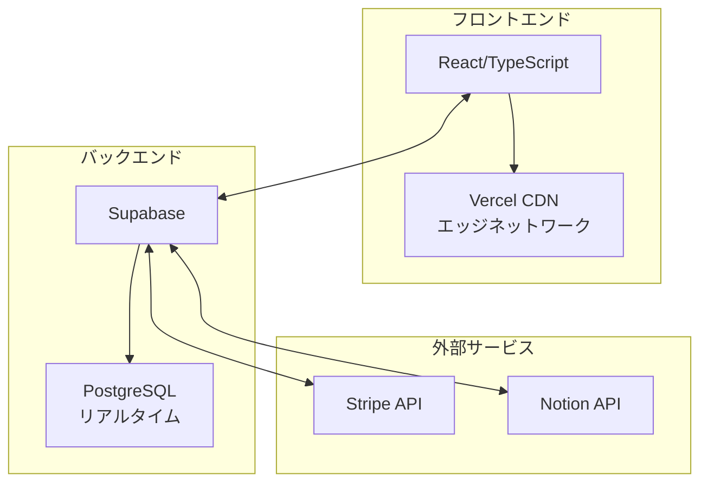
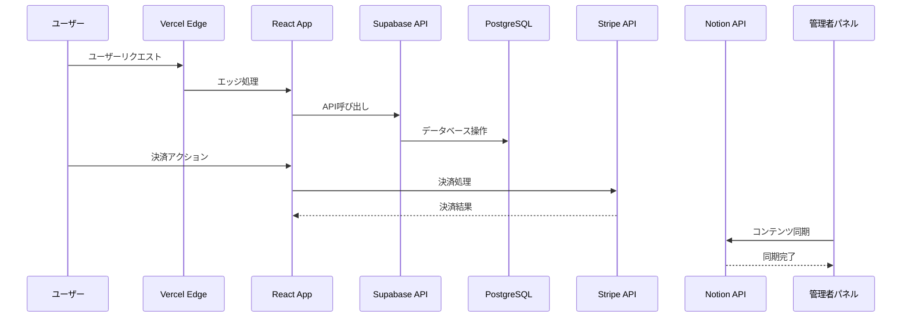
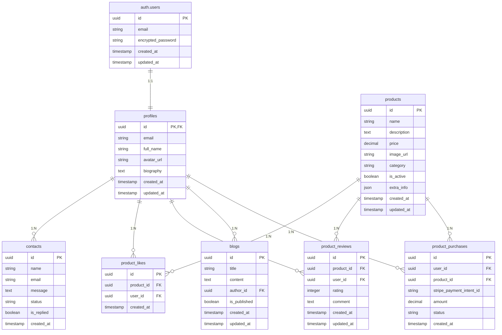
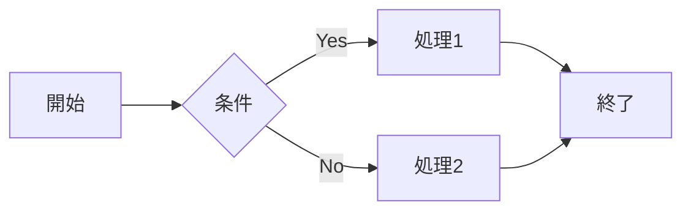
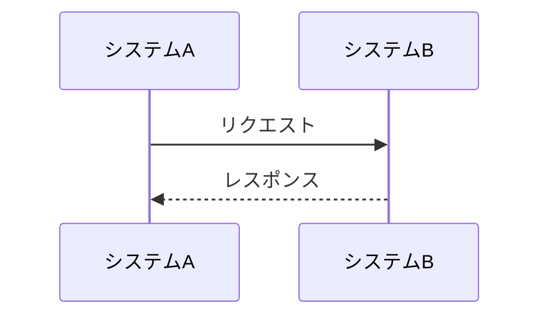
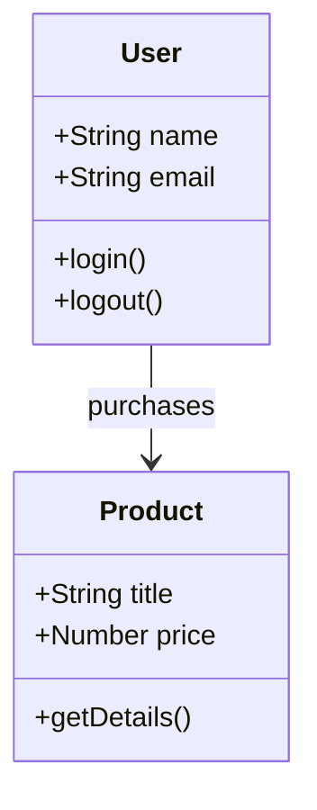

# Portfolio Showcase - Obsidian ワークスペース

## 📋 このファイルの使い方

1. **Obsidian で開く**: このファイルを Obsidian で開いて編集
2. **リアルタイムプレビュー**: マーメイド図が即座に表示される
3. **編集完了後**: マークダウンファイルとして保存
4. **自動エクスポート**: スクリプトで Notion に送信

---

## 🏗️ システムアーキテクチャ図

### 高レベルアーキテクチャ



### データフローアーキテクチャ



---

## 🗄️ データベース設計

### エンティティ関係図（ERD）



---

## 🔄 ワークフロー手順

### Step 1: Obsidian での編集

1. このファイルを Obsidian で開く
2. マーメイド図を編集・調整
3. リアルタイムプレビューで確認
4. 満足いくまで編集

### Step 2: マークダウンファイルへの保存

1. 編集内容を`docs/TECHNICAL_DOCUMENTATION_JA.md`にコピー
2. または、このファイルを直接保存

### Step 3: Notion への自動エクスポート

```bash
npm run export:notion:template
```

### Step 4: Notion での確認

1. 作成されたページを開く
2. マーメイド図が正しく表示されているか確認
3. 必要に応じて調整

---

## 💡 図の編集ヒント

### フローチャート



### シーケンス図



### クラス図



---

## 📝 編集履歴

- **2025-01-18**: 初期版作成
- **次回更新**: 図の調整・追加時

---

## 🎯 完了チェックリスト

- [ ] Obsidian で図を編集・確認
- [ ] マークダウンファイルに保存
- [ ] スクリプトで Notion にエクスポート
- [ ] Notion で図の表示確認
- [ ] 必要に応じて調整・再エクスポート
